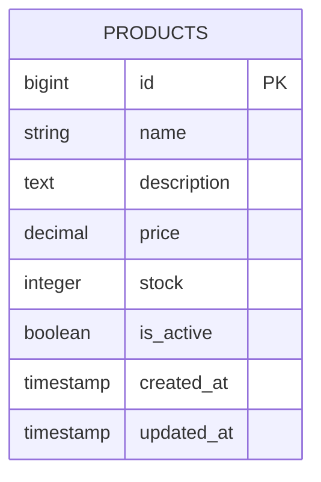
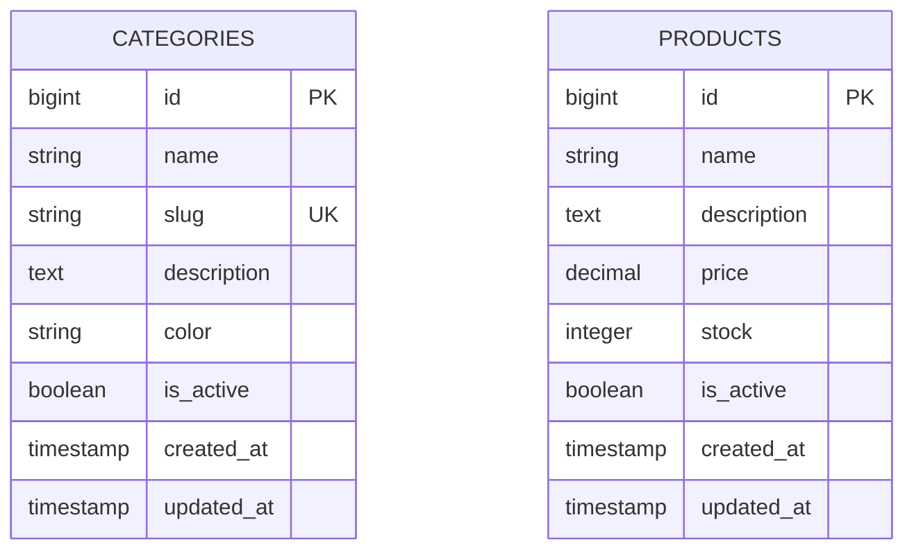
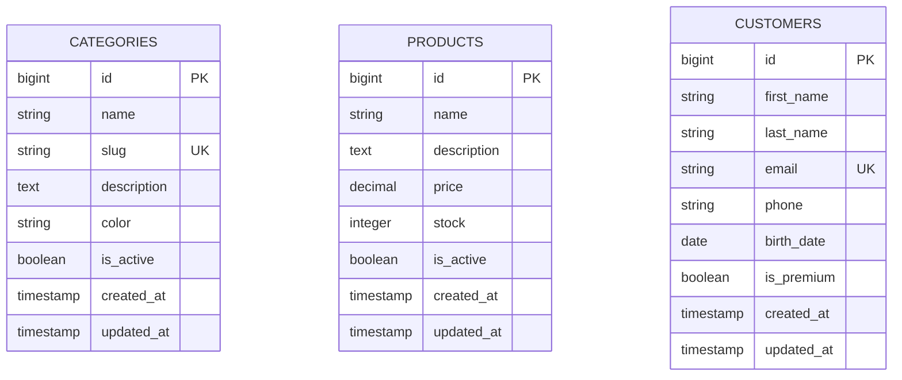
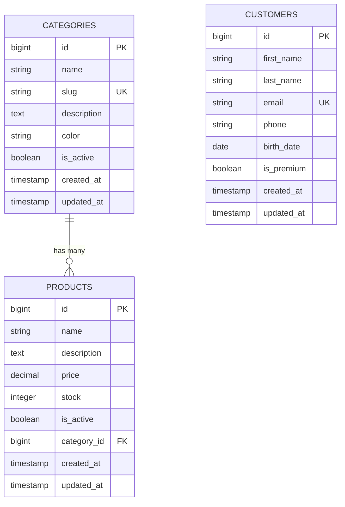
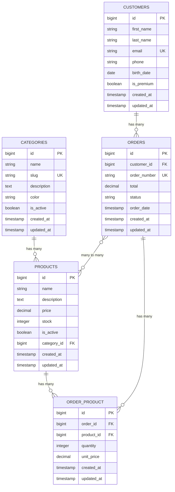
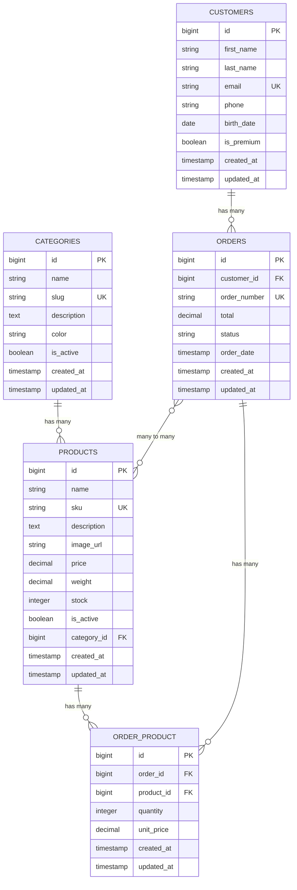
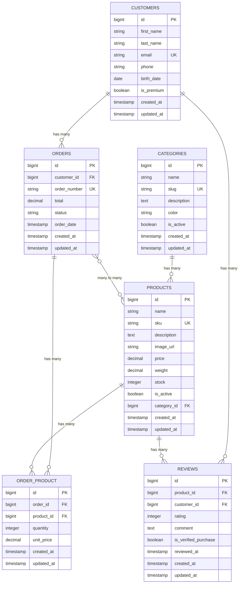
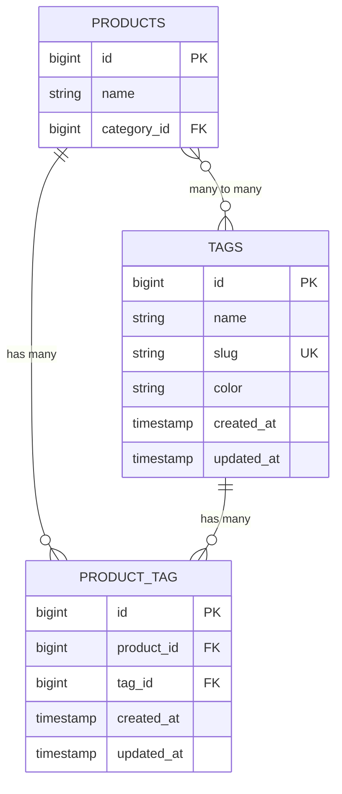
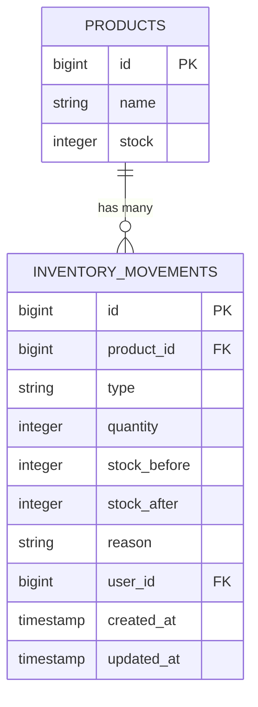
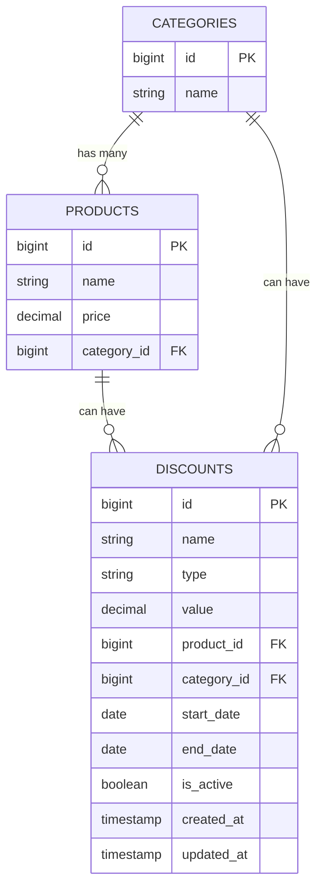

# Laravel: Almacenamiento de Datos - Taller de 3.5 Horas

## Información del Taller

**Duración:** 3.5 horas  
**Nivel:** Principiante  
**Requisitos previos:** Conocimientos básicos de PHP y SQL  

## Objetivos de Aprendizaje

Al finalizar este taller, los estudiantes serán capaces de:
- Comprender el sistema de migraciones de Laravel
- Crear y utilizar seeders para poblar la base de datos
- Trabajar con modelos Eloquent
- Mapear sentencias SQL a Eloquent ORM
- Gestionar relaciones entre tablas
- Aplicar buenas prácticas en el manejo de datos

---

## Agenda del Taller

### Bloque 1: Fundamentos
- Introducción al ORM Eloquent
- Configuración inicial y creación de rama de trabajo
- Migraciones básicas

### Bloque 2: Modelos y Relaciones
- Creación de modelos
- Relaciones entre modelos
- Seeders y Factory

### Descanso

### Bloque 3: Práctica Avanzada
- Mapeo SQL a Eloquent
- Modificación de tablas
- Casos prácticos complejos

---

## Bloque 1: Fundamentos

### 1.1 Preparación del Ambiente de Trabajo

**Crear una nueva rama de trabajo:**

```bash
# Crear y cambiar a una nueva rama
git checkout -b taller-storage-datos

# Verificar que estamos en la nueva rama
git branch
```

### 1.2 Introducción a las Migraciones

Las **migraciones** son como el control de versiones para tu base de datos. Te permiten definir y compartir el esquema de la base de datos de la aplicación.

#### ¿Qué son las migraciones?
- Scripts que definen cambios en la estructura de la base de datos
- Se ejecutan en orden cronológico
- Permiten versionar la estructura de la base de datos
- Facilitan el trabajo en equipo

#### Crear nuestra primera migración

Vamos a crear una tabla para gestionar **productos** en una tienda:

```bash
# Crear migración para tabla productos
php artisan make:migration create_products_table
```

**Diagrama del modelo de datos inicial:**



**Estructura de una migración:**

```php
<?php

use Illuminate\Database\Migrations\Migration;
use Illuminate\Database\Schema\Blueprint;
use Illuminate\Support\Facades\Schema;

return new class extends Migration
{
    public function up(): void
    {
        Schema::create('products', function (Blueprint $table) {
            $table->id();
            $table->string('name');
            $table->text('description')->nullable();
            $table->decimal('price', 8, 2);
            $table->integer('stock');
            $table->boolean('is_active')->default(true);
            $table->timestamps();
        });
    }

    public function down(): void
    {
        Schema::dropIfExists('products');
    }
};
```

#### Tipos de datos más comunes en migraciones:

```php
// Tipos de datos básicos
$table->id();                      // BIGINT AUTO_INCREMENT PRIMARY KEY
$table->string('name');            // VARCHAR(255)
$table->string('name', 100);       // VARCHAR(100)
$table->text('description');       // TEXT
$table->integer('quantity');       // INT
$table->decimal('price', 8, 2);   // DECIMAL(8,2)
$table->boolean('is_active');      // BOOLEAN
$table->date('birth_date');        // DATE
$table->datetime('created_at');    // DATETIME
$table->timestamps();              // created_at y updated_at

// Modificadores
$table->string('email')->unique();           // Único
$table->string('phone')->nullable();         // Acepta NULL
$table->integer('priority')->default(1);     // Valor por defecto
```

### 1.3 Creando nuestra primera tabla - Categorías

Primero creemos una tabla simple para **categorías**:

```bash
# Crear migración para categorías
php artisan make:migration create_categories_table
```

**Diagrama del modelo de datos actualizado:**



**Contenido de la migración:**

```php
<?php

use Illuminate\Database\Migrations\Migration;
use Illuminate\Database\Schema\Blueprint;
use Illuminate\Support\Facades\Schema;

return new class extends Migration
{
    public function up(): void
    {
        Schema::create('categories', function (Blueprint $table) {
            $table->id();
            $table->string('name');
            $table->string('slug')->unique();
            $table->text('description')->nullable();
            $table->string('color', 7)->default('#000000'); // Para colores hex
            $table->boolean('is_active')->default(true);
            $table->timestamps();
        });
    }

    public function down(): void
    {
        Schema::dropIfExists('categories');
    }
};
```

**Ejecutar las migraciones:**

```bash
# Ejecutar todas las migraciones pendientes
php artisan migrate

# Ver el estado de las migraciones
php artisan migrate:status
```

### 1.4 Ejercicio Práctico 1

**Tarea:** Crear una migración para la tabla `customers` (clientes) con los siguientes campos:

- id (auto-incremental)
- first_name (varchar 100)
- last_name (varchar 100)
- email (único)
- phone (nullable)
- birth_date (date, nullable)
- is_premium (boolean, default false)
- timestamps

**Diagrama del modelo de datos con clientes:**



**Solución:**

```bash
php artisan make:migration create_customers_table
```

```php
<?php

use Illuminate\Database\Migrations\Migration;
use Illuminate\Database\Schema\Blueprint;
use Illuminate\Support\Facades\Schema;

return new class extends Migration
{
    public function up(): void
    {
        Schema::create('customers', function (Blueprint $table) {
            $table->id();
            $table->string('first_name', 100);
            $table->string('last_name', 100);
            $table->string('email')->unique();
            $table->string('phone')->nullable();
            $table->date('birth_date')->nullable();
            $table->boolean('is_premium')->default(false);
            $table->timestamps();
        });
    }

    public function down(): void
    {
        Schema::dropIfExists('customers');
    }
};
```

---

## Bloque 2: Modelos y Relaciones

### 2.1 Introducción a los Modelos Eloquent

Los **modelos** en Laravel representan las tablas de la base de datos y nos permiten interactuar con ellas de forma intuitiva.

#### Características de los modelos Eloquent:
- Representan una tabla de la base de datos
- Siguen el patrón Active Record
- Proporcionan métodos para CRUD (Create, Read, Update, Delete)
- Manejan automáticamente timestamps
- Soportan relaciones entre tablas

#### Crear nuestros primeros modelos:

```bash
# Crear modelo para Category
php artisan make:model Category

# Crear modelo para Product
php artisan make:model Product

# Crear modelo para Customer
php artisan make:model Customer
```

#### Estructura básica de un modelo:

```php
<?php

namespace App\Models;

use Illuminate\Database\Eloquent\Model;
use Illuminate\Database\Eloquent\Factories\HasFactory;

class Category extends Model
{
    use HasFactory;

    // Campos que se pueden asignar masivamente
    protected $fillable = [
        'name',
        'slug',
        'description',
        'color',
        'is_active'
    ];

    // Campos que deben ser tratados como fechas
    protected $dates = [
        'created_at',
        'updated_at'
    ];

    // Casting de tipos de datos
    protected $casts = [
        'is_active' => 'boolean',
    ];
}
```

### 2.2 Operaciones CRUD Básicas

Vamos a crear un archivo PHP simple para practicar operaciones básicas:

**Crear archivo de práctica:**

```bash
# Crear archivo para prácticas
touch ./practica_modelos.php
```

**Contenido del archivo de práctica:**

```php
<?php

require_once 'vendor/autoload.php';

// Configurar la aplicación Laravel para usar en consola
$app = require_once 'bootstrap/app.php';
$app->make(Illuminate\Contracts\Console\Kernel::class)->bootstrap();

use App\Models\Category;
use App\Models\Product;
use App\Models\Customer;

echo "=== PRÁCTICA DE MODELOS ELOQUENT ===\n\n";

// 1. CREAR (CREATE)
echo "1. CREANDO CATEGORÍAS:\n";

$category1 = Category::create([
    'name' => 'Electrónicos',
    'slug' => 'electronicos',
    'description' => 'Productos electrónicos y tecnología',
    'color' => '#007bff',
    'is_active' => true
]);

$category2 = new Category();
$category2->name = 'Ropa';
$category2->slug = 'ropa';
$category2->description = 'Vestimenta y accesorios';
$category2->color = '#28a745';
$category2->is_active = true;
$category2->save();

echo "Categoría 1 creada: {$category1->name} (ID: {$category1->id})\n";
echo "Categoría 2 creada: {$category2->name} (ID: {$category2->id})\n\n";

// 2. LEER (READ)
echo "2. LEYENDO CATEGORÍAS:\n";

// Obtener todas las categorías
$allCategories = Category::all();
echo "Total de categorías: " . $allCategories->count() . "\n";

// Obtener por ID
$category = Category::find(1);
if ($category) {
    echo "Categoría con ID 1: {$category->name}\n";
}

// Buscar por campo
$electronics = Category::where('slug', 'electronicos')->first();
if ($electronics) {
    echo "Categoría de electrónicos: {$electronics->name}\n";
}

echo "\n";

// 3. ACTUALIZAR (UPDATE)
echo "3. ACTUALIZANDO CATEGORÍAS:\n";

$category1->description = 'Productos de tecnología y electrónicos actualizados';
$category1->save();
echo "Descripción de {$category1->name} actualizada\n";

// Actualización masiva
Category::where('slug', 'ropa')->update(['color' => '#ffc107']);
echo "Color de categoría ropa actualizado\n\n";

// 4. ELIMINAR (DELETE)
echo "4. OPERACIONES DE ELIMINACIÓN:\n";

// Eliminar por modelo
$categoryToDelete = Category::where('slug', 'ropa')->first();
if ($categoryToDelete) {
    $categoryToDelete->delete();
    echo "Categoría 'Ropa' eliminada\n";
}

echo "\n";

// 5. LISTAR CATEGORÍAS RESTANTES
echo "5. CATEGORÍAS FINALES:\n";
$finalCategories = Category::all();
foreach ($finalCategories as $cat) {
    echo "- {$cat->name} ({$cat->slug}) - Color: {$cat->color}\n";
}

echo "\n=== FIN DE LA PRÁCTICA ===\n";
```

**Ejecutar el archivo de práctica:**

```bash
php practica_modelos.php
```

### 2.3 Relaciones entre Modelos

Las relaciones son una de las características más poderosas de Eloquent. Vamos a implementar relaciones entre nuestras tablas.

#### Paso 1: Modificar la migración de productos para incluir category_id

```bash
# Crear migración para agregar foreign key
php artisan make:migration add_category_id_to_products_table
```

**Diagrama del modelo con primera relación:**



**Contenido de la migración:**

```php
<?php

use Illuminate\Database\Migrations\Migration;
use Illuminate\Database\Schema\Blueprint;
use Illuminate\Support\Facades\Schema;

return new class extends Migration
{
    public function up(): void
    {
        Schema::table('products', function (Blueprint $table) {
            $table->foreignId('category_id')->constrained()->onDelete('cascade');
        });
    }

    public function down(): void
    {
        Schema::table('products', function (Blueprint $table) {
            $table->dropForeign(['category_id']);
            $table->dropColumn('category_id');
        });
    }
};
```

#### Paso 2: Definir las relaciones en los modelos

**Modelo Category:**

```php
<?php

namespace App\Models;

use Illuminate\Database\Eloquent\Factories\HasFactory;
use Illuminate\Database\Eloquent\Model;

class Category extends Model
{
    use HasFactory;

    protected $fillable = [
        'name',
        'slug',
        'description',
        'color',
        'is_active'
    ];

    protected $casts = [
        'is_active' => 'boolean',
    ];

    // Relación: Una categoría tiene muchos productos
    public function products()
    {
        return $this->hasMany(Product::class);
    }
}
```

**Modelo Product:**

```php
<?php

namespace App\Models;

use Illuminate\Database\Eloquent\Factories\HasFactory;
use Illuminate\Database\Eloquent\Model;

class Product extends Model
{
    use HasFactory;

    protected $fillable = [
        'name',
        'description',
        'price',
        'stock',
        'is_active',
        'category_id'
    ];

    protected $casts = [
        'price' => 'decimal:2',
        'is_active' => 'boolean',
    ];

    // Relación: Un producto pertenece a una categoría
    public function category()
    {
        return $this->belongsTo(Category::class);
    }
}
```

#### Paso 3: Crear tabla de pedidos para relación muchos a muchos

```bash
# Crear migración para orders
php artisan make:migration create_orders_table

# Crear migración para la tabla pivot
php artisan make:migration create_order_product_table
```

**Diagrama del modelo completo con relaciones muchos a muchos:**



**Migración de orders:**

```php
<?php

use Illuminate\Database\Migrations\Migration;
use Illuminate\Database\Schema\Blueprint;
use Illuminate\Support\Facades\Schema;

return new class extends Migration
{
    public function up(): void
    {
        Schema::create('orders', function (Blueprint $table) {
            $table->id();
            $table->foreignId('customer_id')->constrained()->onDelete('cascade');
            $table->string('order_number')->unique();
            $table->decimal('total', 10, 2);
            $table->enum('status', ['pending', 'processing', 'shipped', 'delivered', 'cancelled']);
            $table->timestamp('order_date');
            $table->timestamps();
        });
    }

    public function down(): void
    {
        Schema::dropIfExists('orders');
    }
};
```

**Migración de la tabla pivot order_product:**

```php
<?php

use Illuminate\Database\Migrations\Migration;
use Illuminate\Database\Schema\Blueprint;
use Illuminate\Support\Facades\Schema;

return new class extends Migration
{
    public function up(): void
    {
        Schema::create('order_product', function (Blueprint $table) {
            $table->id();
            $table->foreignId('order_id')->constrained()->onDelete('cascade');
            $table->foreignId('product_id')->constrained()->onDelete('cascade');
            $table->integer('quantity');
            $table->decimal('unit_price', 8, 2);
            $table->timestamps();
        });
    }

    public function down(): void
    {
        Schema::dropIfExists('order_product');
    }
};
```

### 2.4 Seeders y Factories

Los **seeders** nos permiten poblar la base de datos con datos de prueba de forma automatizada.

#### Crear seeders:

```bash
# Crear seeders
php artisan make:seeder CategorySeeder
php artisan make:seeder ProductSeeder
php artisan make:seeder CustomerSeeder
```

**CategorySeeder:**

```php
<?php

namespace Database\Seeders;

use App\Models\Category;
use Illuminate\Database\Seeder;

class CategorySeeder extends Seeder
{
    public function run(): void
    {
        $categories = [
            [
                'name' => 'Electrónicos',
                'slug' => 'electronicos',
                'description' => 'Productos electrónicos y tecnología',
                'color' => '#007bff',
                'is_active' => true
            ],
            [
                'name' => 'Ropa y Accesorios',
                'slug' => 'ropa-accesorios',
                'description' => 'Vestimenta y accesorios de moda',
                'color' => '#28a745',
                'is_active' => true
            ],
            [
                'name' => 'Hogar y Jardín',
                'slug' => 'hogar-jardin',
                'description' => 'Artículos para el hogar y jardinería',
                'color' => '#ffc107',
                'is_active' => true
            ],
            [
                'name' => 'Deportes',
                'slug' => 'deportes',
                'description' => 'Equipos y accesorios deportivos',
                'color' => '#dc3545',
                'is_active' => true
            ]
        ];

        foreach ($categories as $categoryData) {
            Category::create($categoryData);
        }
    }
}
```

**ProductSeeder:**

```php
<?php

namespace Database\Seeders;

use App\Models\Product;
use App\Models\Category;
use Illuminate\Database\Seeder;

class ProductSeeder extends Seeder
{
    public function run(): void
    {
        $electronics = Category::where('slug', 'electronicos')->first();
        $clothing = Category::where('slug', 'ropa-accesorios')->first();
        $home = Category::where('slug', 'hogar-jardin')->first();
        $sports = Category::where('slug', 'deportes')->first();

        $products = [
            // Electrónicos
            [
                'name' => 'iPhone 15 Pro',
                'description' => 'Smartphone Apple con pantalla de 6.1 pulgadas',
                'price' => 999.99,
                'stock' => 50,
                'is_active' => true,
                'category_id' => $electronics->id
            ],
            [
                'name' => 'Laptop HP Pavilion',
                'description' => 'Laptop con procesador Intel i7 y 16GB RAM',
                'price' => 799.99,
                'stock' => 25,
                'is_active' => true,
                'category_id' => $electronics->id
            ],
            
            // Ropa
            [
                'name' => 'Camiseta Básica',
                'description' => 'Camiseta de algodón 100% en varios colores',
                'price' => 19.99,
                'stock' => 100,
                'is_active' => true,
                'category_id' => $clothing->id
            ],
            [
                'name' => 'Jeans Clásicos',
                'description' => 'Pantalón jean de corte clásico',
                'price' => 49.99,
                'stock' => 75,
                'is_active' => true,
                'category_id' => $clothing->id
            ],
            
            // Hogar
            [
                'name' => 'Aspiradora Robot',
                'description' => 'Aspiradora automática con WiFi',
                'price' => 299.99,
                'stock' => 20,
                'is_active' => true,
                'category_id' => $home->id
            ],
            
            // Deportes
            [
                'name' => 'Balón de Fútbol',
                'description' => 'Balón oficial de fútbol profesional',
                'price' => 39.99,
                'stock' => 40,
                'is_active' => true,
                'category_id' => $sports->id
            ]
        ];

        foreach ($products as $productData) {
            Product::create($productData);
        }
    }
}
```

**Actualizar DatabaseSeeder:**

```php
<?php

namespace Database\Seeders;

use Illuminate\Database\Seeder;

class DatabaseSeeder extends Seeder
{
    public function run(): void
    {
        $this->call([
            CategorySeeder::class,
            ProductSeeder::class,
        ]);
    }
}
```

**Ejecutar los seeders:**

```bash
# Ejecutar migraciones y seeders
php artisan migrate --seed

# O solo los seeders
php artisan db:seed
```

---

## Descanso

---

## Bloque 3: Práctica Avanzada

### 3.1 Mapeo SQL a Eloquent

Una de las habilidades más importantes es saber cómo convertir consultas SQL tradicionales a Eloquent. Veamos los casos más comunes:

#### Tabla de Equivalencias SQL ↔ Eloquent

| SQL | Eloquent |
|-----|----------|
| `SELECT * FROM products` | `Product::all()` |
| `SELECT * FROM products WHERE id = 1` | `Product::find(1)` |
| `SELECT * FROM products WHERE price > 100` | `Product::where('price', '>', 100)->get()` |
| `SELECT * FROM products WHERE name LIKE '%phone%'` | `Product::where('name', 'like', '%phone%')->get()` |
| `SELECT * FROM products ORDER BY price DESC` | `Product::orderBy('price', 'desc')->get()` |
| `SELECT * FROM products LIMIT 10` | `Product::take(10)->get()` |
| `SELECT COUNT(*) FROM products` | `Product::count()` |
| `SELECT AVG(price) FROM products` | `Product::avg('price')` |
| `INSERT INTO products (...) VALUES (...)` | `Product::create([...])` |
| `UPDATE products SET price = 100 WHERE id = 1` | `Product::find(1)->update(['price' => 100])` |
| `DELETE FROM products WHERE id = 1` | `Product::find(1)->delete()` |

#### Ejemplos prácticos:

```php
<?php

require_once 'vendor/autoload.php';
$app = require_once 'bootstrap/app.php';
$app->make(Illuminate\Contracts\Console\Kernel::class)->bootstrap();

use App\Models\Category;
use App\Models\Product;

echo "=== MAPEO SQL A ELOQUENT ===\n\n";

// 1. Consultas básicas
echo "1. CONSULTAS BÁSICAS:\n";

// SQL: SELECT * FROM products WHERE stock > 50
$productsWithStock = Product::where('stock', '>', 50)->get();
echo "Productos con stock > 50: " . $productsWithStock->count() . "\n";

// SQL: SELECT * FROM products WHERE price BETWEEN 20 AND 100
$affordableProducts = Product::whereBetween('price', [20, 100])->get();
echo "Productos entre $20 y $100: " . $affordableProducts->count() . "\n";

// SQL: SELECT * FROM products WHERE name LIKE '%iPhone%'
$iphones = Product::where('name', 'like', '%iPhone%')->get();
echo "Productos que contienen 'iPhone': " . $iphones->count() . "\n\n";

// 2. Consultas con JOIN
echo "2. CONSULTAS CON RELACIONES:\n";

// SQL: SELECT p.*, c.name as category_name FROM products p JOIN categories c ON p.category_id = c.id
$productsWithCategory = Product::with('category')->get();
foreach ($productsWithCategory->take(3) as $product) {
    echo "- {$product->name} (Categoría: {$product->category->name})\n";
}

echo "\n";

// 3. Consultas agregadas
echo "3. CONSULTAS AGREGADAS:\n";

// SQL: SELECT COUNT(*) FROM products
$totalProducts = Product::count();
echo "Total de productos: {$totalProducts}\n";

// SQL: SELECT AVG(price) FROM products
$averagePrice = Product::avg('price');
echo "Precio promedio: $" . number_format($averagePrice, 2) . "\n";

// SQL: SELECT category_id, COUNT(*) FROM products GROUP BY category_id
$productsByCategory = Product::selectRaw('category_id, count(*) as total')
    ->groupBy('category_id')
    ->with('category')
    ->get();

echo "Productos por categoría:\n";
foreach ($productsByCategory as $group) {
    echo "- {$group->category->name}: {$group->total} productos\n";
}

echo "\n";

// 4. Consultas complejas
echo "4. CONSULTAS COMPLEJAS:\n";

// SQL: SELECT * FROM products WHERE price > (SELECT AVG(price) FROM products)
$expensiveProducts = Product::where('price', '>', Product::avg('price'))->get();
echo "Productos más caros que el promedio: " . $expensiveProducts->count() . "\n";

// Productos con stock bajo por categoría
$lowStockByCategory = Product::where('stock', '<', 30)
    ->with('category')
    ->orderBy('stock', 'asc')
    ->get();

echo "Productos con stock bajo:\n";
foreach ($lowStockByCategory as $product) {
    echo "- {$product->name}: {$product->stock} unidades ({$product->category->name})\n";
}

echo "\n=== FIN DEL MAPEO ===\n";
```

### 3.2 Modificación de Tablas

En el desarrollo real, necesitamos modificar las tablas existentes. Veamos cómo hacerlo correctamente:

#### Agregar campos a una tabla existente:

```bash
# Agregar campo image_url a products
php artisan make:migration add_image_url_to_products_table
```

**Diagrama del modelo con campos adicionales:**



**Contenido de la migración:**

```php
<?php

use Illuminate\Database\Migrations\Migration;
use Illuminate\Database\Schema\Blueprint;
use Illuminate\Support\Facades\Schema;

return new class extends Migration
{
    public function up(): void
    {
        Schema::table('products', function (Blueprint $table) {
            $table->string('image_url')->nullable()->after('description');
            $table->string('sku')->unique()->after('name');
            $table->decimal('weight', 5, 2)->nullable()->after('price');
        });
    }

    public function down(): void
    {
        Schema::table('products', function (Blueprint $table) {
            $table->dropColumn(['image_url', 'sku', 'weight']);
        });
    }
};
```

#### Modificar campos existentes:

```bash
# Modificar campo description para que sea más largo
php artisan make:migration modify_products_description_column
```

**Contenido de la migración:**

```php
<?php

use Illuminate\Database\Migrations\Migration;
use Illuminate\Database\Schema\Blueprint;
use Illuminate\Support\Facades\Schema;

return new class extends Migration
{
    public function up(): void
    {
        Schema::table('products', function (Blueprint $table) {
            $table->longText('description')->nullable()->change();
        });
    }

    public function down(): void
    {
        Schema::table('products', function (Blueprint $table) {
            $table->text('description')->nullable()->change();
        });
    }
};
```

#### Crear índices para optimización:

```bash
# Crear índices para mejorar rendimiento
php artisan make:migration add_indexes_to_products_table
```

**Contenido de la migración:**

```php
<?php

use Illuminate\Database\Migrations\Migration;
use Illuminate\Database\Schema\Blueprint;
use Illuminate\Support\Facades\Schema;

return new class extends Migration
{
    public function up(): void
    {
        Schema::table('products', function (Blueprint $table) {
            $table->index('category_id');
            $table->index('is_active');
            $table->index(['category_id', 'is_active']);
            $table->index('price');
        });
    }

    public function down(): void
    {
        Schema::table('products', function (Blueprint $table) {
            $table->dropIndex(['category_id']);
            $table->dropIndex(['is_active']);
            $table->dropIndex(['category_id', 'is_active']);
            $table->dropIndex(['price']);
        });
    }
};
```

### 3.3 Caso Práctico Complejo

Vamos a crear un sistema más complejo con **reseñas de productos**:

#### Crear la migración y modelo para reviews:

```bash
# Crear migración y modelo
php artisan make:model Review -m
```

**Diagrama del modelo final completo con reviews:**



**Migración para reviews:**

```php
<?php

use Illuminate\Database\Migrations\Migration;
use Illuminate\Database\Schema\Blueprint;
use Illuminate\Support\Facades\Schema;

return new class extends Migration
{
    public function up(): void
    {
        Schema::create('reviews', function (Blueprint $table) {
            $table->id();
            $table->foreignId('product_id')->constrained()->onDelete('cascade');
            $table->foreignId('customer_id')->constrained()->onDelete('cascade');
            $table->integer('rating')->unsigned()->between(1, 5);
            $table->text('comment')->nullable();
            $table->boolean('is_verified_purchase')->default(false);
            $table->timestamp('reviewed_at');
            $table->timestamps();
            
            // Un cliente solo puede reseñar un producto una vez
            $table->unique(['product_id', 'customer_id']);
        });
    }

    public function down(): void
    {
        Schema::dropIfExists('reviews');
    }
};
```

**Modelo Review:**

```php
<?php

namespace App\Models;

use Illuminate\Database\Eloquent\Factories\HasFactory;
use Illuminate\Database\Eloquent\Model;

class Review extends Model
{
    use HasFactory;

    protected $fillable = [
        'product_id',
        'customer_id',
        'rating',
        'comment',
        'is_verified_purchase',
        'reviewed_at'
    ];

    protected $casts = [
        'is_verified_purchase' => 'boolean',
        'reviewed_at' => 'datetime',
    ];

    // Relaciones
    public function product()
    {
        return $this->belongsTo(Product::class);
    }

    public function customer()
    {
        return $this->belongsTo(Customer::class);
    }
}
```

**Actualizar modelo Product para incluir relación con reviews:**

```php
// Agregar al modelo Product
public function reviews()
{
    return $this->hasMany(Review::class);
}

// Método para calcular rating promedio
public function averageRating()
{
    return $this->reviews()->avg('rating');
}

// Método para contar reseñas
public function reviewsCount()
{
    return $this->reviews()->count();
}
```

**Actualizar modelo Customer:**

```php
// Agregar al modelo Customer
public function reviews()
{
    return $this->hasMany(Review::class);
}
```

#### Archivo de práctica avanzada:

```php
<?php

require_once 'vendor/autoload.php';
$app = require_once 'bootstrap/app.php';
$app->make(Illuminate\Contracts\Console\Kernel::class)->bootstrap();

use App\Models\Category;
use App\Models\Product;
use App\Models\Customer;
use App\Models\Review;

echo "=== CASO PRÁCTICO AVANZADO ===\n\n";

// 1. Crear algunos clientes de prueba
echo "1. CREANDO CLIENTES DE PRUEBA:\n";

$customers = [
    [
        'first_name' => 'Juan',
        'last_name' => 'Pérez',
        'email' => 'juan.perez@email.com',
        'phone' => '+1234567890',
        'is_premium' => false
    ],
    [
        'first_name' => 'María',
        'last_name' => 'González',
        'email' => 'maria.gonzalez@email.com',
        'phone' => '+1234567891',
        'is_premium' => true
    ],
    [
        'first_name' => 'Carlos',
        'last_name' => 'Rodríguez',
        'email' => 'carlos.rodriguez@email.com',
        'phone' => '+1234567892',
        'is_premium' => false
    ]
];

foreach ($customers as $customerData) {
    $customer = Customer::create($customerData);
    echo "Cliente creado: {$customer->first_name} {$customer->last_name}\n";
}

echo "\n";

// 2. Crear reseñas para productos
echo "2. CREANDO RESEÑAS:\n";

$iphone = Product::where('name', 'like', '%iPhone%')->first();
$laptop = Product::where('name', 'like', '%Laptop%')->first();

if ($iphone && $laptop) {
    $reviews = [
        [
            'product_id' => $iphone->id,
            'customer_id' => 1,
            'rating' => 5,
            'comment' => 'Excelente producto, muy satisfecho con la compra',
            'is_verified_purchase' => true,
            'reviewed_at' => now()
        ],
        [
            'product_id' => $iphone->id,
            'customer_id' => 2,
            'rating' => 4,
            'comment' => 'Buen teléfono, aunque un poco caro',
            'is_verified_purchase' => true,
            'reviewed_at' => now()->subDays(2)
        ],
        [
            'product_id' => $laptop->id,
            'customer_id' => 3,
            'rating' => 5,
            'comment' => 'Perfecta para trabajo, muy rápida',
            'is_verified_purchase' => true,
            'reviewed_at' => now()->subDays(1)
        ]
    ];

    foreach ($reviews as $reviewData) {
        Review::create($reviewData);
        echo "Reseña creada para producto ID: {$reviewData['product_id']}\n";
    }
}

echo "\n";

// 3. Consultas complejas con relaciones
echo "3. CONSULTAS COMPLEJAS:\n";

// Productos con sus reseñas
$productsWithReviews = Product::with(['reviews.customer', 'category'])
    ->whereHas('reviews')
    ->get();

echo "Productos con reseñas:\n";
foreach ($productsWithReviews as $product) {
    $avgRating = round($product->averageRating(), 1);
    $reviewsCount = $product->reviewsCount();
    
    echo "- {$product->name}\n";
    echo "  Categoría: {$product->category->name}\n";
    echo "  Rating promedio: {$avgRating}/5 ({$reviewsCount} reseñas)\n";
    
    foreach ($product->reviews as $review) {
        echo "    * {$review->rating}/5 - {$review->customer->first_name}: \"{$review->comment}\"\n";
    }
    echo "\n";
}

// 4. Top productos por rating
echo "4. TOP PRODUCTOS POR RATING:\n";

$topProducts = Product::withAvg('reviews', 'rating')
    ->withCount('reviews')
    ->whereHas('reviews')
    ->orderBy('reviews_avg_rating', 'desc')
    ->get();

foreach ($topProducts as $product) {
    $avgRating = round($product->reviews_avg_rating, 1);
    echo "- {$product->name}: {$avgRating}/5 ({$product->reviews_count} reseñas)\n";
}

echo "\n";

// 5. Clientes más activos
echo "5. CLIENTES MÁS ACTIVOS:\n";

$activeCustomers = Customer::withCount('reviews')
    ->whereHas('reviews')
    ->orderBy('reviews_count', 'desc')
    ->get();

foreach ($activeCustomers as $customer) {
    echo "- {$customer->first_name} {$customer->last_name}: {$customer->reviews_count} reseñas\n";
}

echo "\n=== FIN DEL CASO PRÁCTICO ===\n";
```

---

## Ejercicios para Practicar

### Ejercicio 1: Sistema de Tags
Crear un sistema de etiquetas para productos (relación muchos a muchos):

1. Crear migración para tabla `tags`
2. Crear tabla pivot `product_tag`
3. Definir relaciones en los modelos
4. Crear seeder para tags
5. Asignar tags a productos

**Diagrama propuesto para el ejercicio:**



### Ejercicio 2: Sistema de Inventario
Extender el sistema con control de inventario:

1. Crear tabla `inventory_movements`
2. Registrar entradas y salidas de stock
3. Crear métodos para actualizar stock automáticamente
4. Implementar alertas de stock bajo

**Diagrama propuesto para el ejercicio:**



### Ejercicio 3: Sistema de Descuentos
Implementar sistema de descuentos:

1. Crear tabla `discounts`
2. Aplicar descuentos por categoría o producto específico
3. Calcular precios con descuento
4. Validar fechas de vigencia

**Diagrama propuesto para el ejercicio:**



---

## Resumen del Taller

### Conceptos Aprendidos

1. **Migraciones**:
   - Crear y ejecutar migraciones
   - Modificar tablas existentes
   - Rollback de migraciones
   - Buenas prácticas

2. **Modelos Eloquent**:
   - Creación de modelos
   - Configuración de fillable y casts
   - Operaciones CRUD básicas
   - Relaciones entre modelos

3. **Seeders**:
   - Poblar base de datos con datos de prueba
   - Organizar seeders por entidad
   - Ejecutar seeders de forma selectiva

4. **Mapeo SQL ↔ Eloquent**:
   - Conversión de consultas SQL comunes
   - Uso de Query Builder
   - Consultas con relaciones
   - Agregaciones y agrupaciones

5. **Relaciones**:
   - One to Many (hasMany/belongsTo)
   - Many to Many (belongsToMany)
   - Carga eager loading
   - Consultas con relaciones

### Mejores Prácticas Aprendidas

1. **Nombramiento**:
   - Tablas en plural, modelos en singular
   - Snake_case para campos de BD
   - CamelCase para métodos y propiedades

2. **Migraciones**:
   - Una migración por cambio
   - Siempre incluir método down()
   - Usar foreign keys apropiadamente

3. **Modelos**:
   - Definir fillable correctamente
   - Usar casts para tipos de datos
   - Implementar relaciones claramente

4. **Performance**:
   - Usar eager loading para evitar N+1
   - Crear índices apropiados
   - Limitar resultados cuando sea necesario

---

## Recursos Adicionales

### Documentación Oficial
- [Laravel Migrations](https://laravel.com/docs/migrations)
- [Eloquent ORM](https://laravel.com/docs/eloquent)
- [Database Seeding](https://laravel.com/docs/seeding)

### Comandos Útiles
```bash
# Migraciones
php artisan make:migration create_table_name
php artisan migrate
php artisan migrate:rollback
php artisan migrate:reset
php artisan migrate:fresh --seed

# Modelos
php artisan make:model ModelName
php artisan make:model ModelName -m  # Con migración
php artisan make:model ModelName -mfs # Con migración, factory y seeder

# Seeders
php artisan make:seeder SeederName
php artisan db:seed
php artisan db:seed --class=SeederName
```

### Próximos Pasos
1. Estudiar Factory para generar datos de prueba masivos
2. Aprender sobre Mutators y Accessors
3. Implementar Observers para eventos de modelo
4. Explorar Query Scopes para consultas reutilizables
5. Practicar con relaciones polimórficas

---

## Conclusión

En este taller hemos cubierto los fundamentos del almacenamiento de datos en Laravel, desde las migraciones básicas hasta relaciones complejas y consultas avanzadas. El sistema ORM Eloquent es una herramienta poderosa que facilita enormemente el trabajo con bases de datos.

**Recuerda**: La práctica es clave. Continúa experimentando con diferentes tipos de relaciones y consultas para dominar completamente estas herramientas.

¡Felicitaciones por completar el taller!
