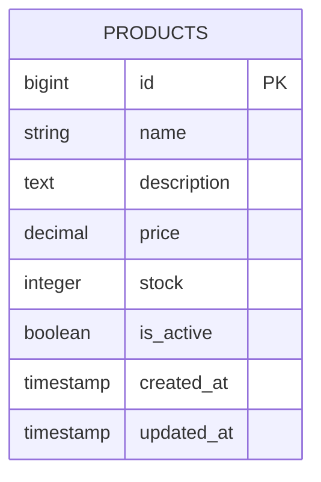
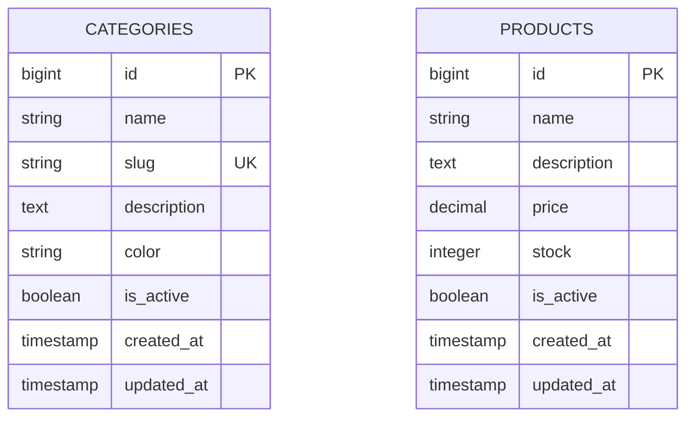
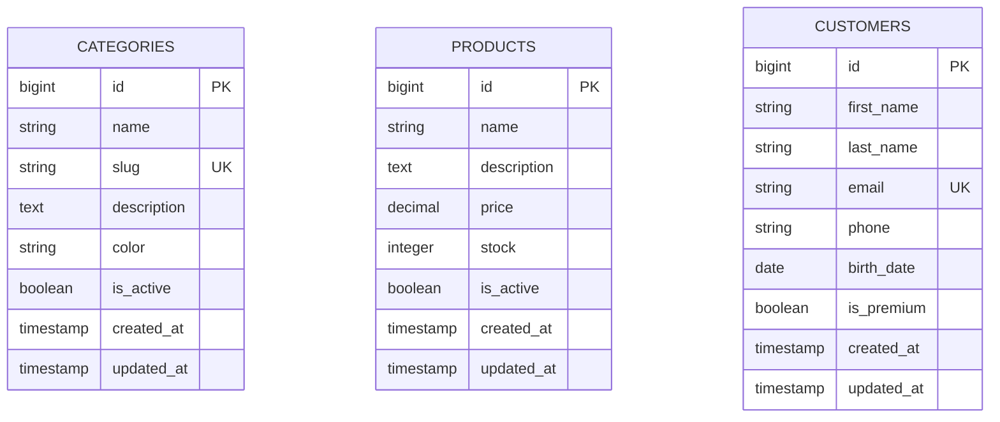
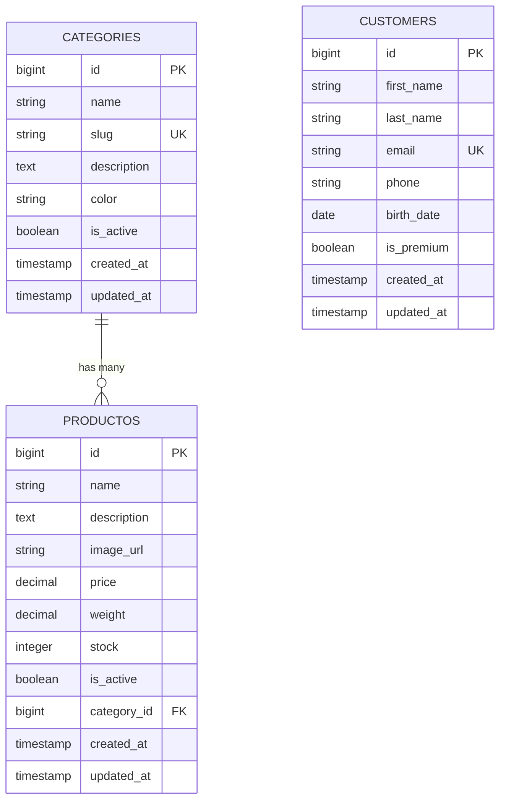
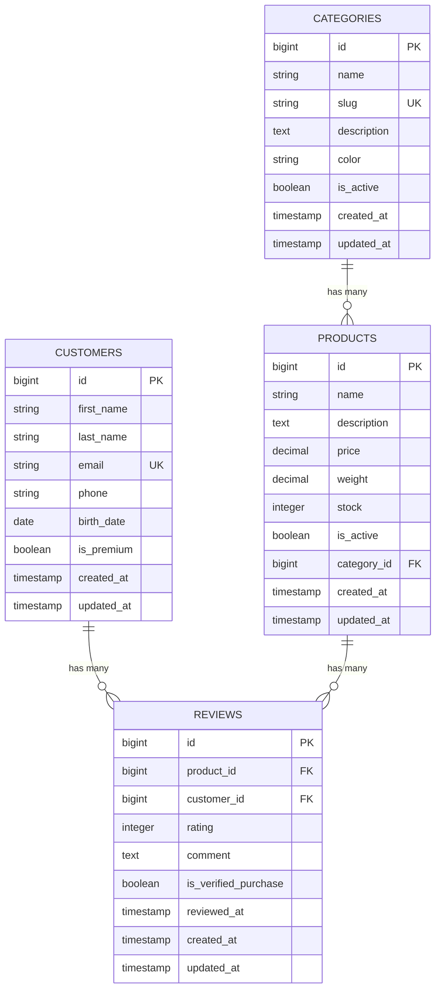

# Laravel: Almacenamiento de Datos - Taller de 3.5 Horas

## Información del Taller

**Duración:** 3.5 horas  
**Nivel:** Principiante  
**Requisitos previos:** Conocimientos básicos de PHP y SQL  

## Objetivos de Aprendizaje

Al finalizar este taller, los estudiantes serán capaces de:
- Comprender el sistema de migraciones de Laravel
- Crear y utilizar seeders para poblar la base de datos
- Trabajar con modelos Eloquent
- Mapear sentencias SQL a Eloquent ORM
- Gestionar relaciones entre tablas
- Aplicar buenas prácticas en el manejo de datos

---

## Agenda del Taller

### Bloque 1: Fundamentos
- Introducción al ORM Eloquent
- Configuración inicial y creación de rama de trabajo
- Migraciones básicas

### Bloque 2: Modelos y Datos
- Creación de modelos
- Operaciones CRUD básicas
- Métodos Eloquent fundamentales

### Descanso

### Bloque 3: Práctica Avanzada
- Mapeo SQL a Eloquent
- Modificación de tablas
- Casos prácticos complejos

---

## Bloque 1: Fundamentos

### 1.1 Preparación del Ambiente de Trabajo

**Crear una nueva rama de trabajo:**

```bash
# Crear y cambiar a una nueva rama
git checkout -b taller-storage-datos

# Verificar que estamos en la nueva rama
git branch
```

### 1.2 Introducción a las Migraciones

Las **migraciones** son como el control de versiones para tu base de datos. Te permiten definir y compartir el esquema de la base de datos de la aplicación.

#### ¿Qué son las migraciones?
- Scripts que definen cambios en la estructura de la base de datos
- Se ejecutan en orden cronológico
- Permiten versionar la estructura de la base de datos
- Facilitan el trabajo en equipo

#### Crear nuestra primera migración

Vamos a crear una tabla para gestionar **productos** en una tienda:

```bash
# Crear migración para tabla productos
php artisan make:migration create_products_table
```

**Diagrama del modelo de datos inicial:**



**Estructura de una migración:**

```php
<?php

use Illuminate\Database\Migrations\Migration;
use Illuminate\Database\Schema\Blueprint;
use Illuminate\Support\Facades\Schema;

return new class extends Migration
{
    public function up(): void
    {
        Schema::create('products', function (Blueprint $table) {
            $table->id();
            $table->string('name');
            $table->text('description')->nullable();
            $table->decimal('price', 8, 2);
            $table->integer('stock');
            $table->boolean('is_active')->default(true);
            $table->timestamps();
        });
    }

    public function down(): void
    {
        Schema::dropIfExists('products');
    }
};
```

#### Tipos de datos más comunes en migraciones:

```php
// Tipos de datos básicos
$table->id();                      // BIGINT AUTO_INCREMENT PRIMARY KEY
$table->string('name');            // VARCHAR(255)
$table->string('name', 100);       // VARCHAR(100)
$table->text('description');       // TEXT
$table->integer('quantity');       // INT
$table->decimal('price', 8, 2);   // DECIMAL(8,2)
$table->boolean('is_active');      // BOOLEAN
$table->date('birth_date');        // DATE
$table->datetime('created_at');    // DATETIME
$table->timestamps();              // created_at y updated_at

// Modificadores
$table->string('email')->unique();           // Único
$table->string('phone')->nullable();         // Acepta NULL
$table->integer('priority')->default(1);     // Valor por defecto
```

### 1.3 Creando nuestra primera tabla - Categorías

Primero creemos una tabla simple para **categorías**:

```bash
# Crear migración para categorías
php artisan make:migration create_categories_table
```

**Diagrama del modelo de datos actualizado:**



**Contenido de la migración:**

```php
<?php

use Illuminate\Database\Migrations\Migration;
use Illuminate\Database\Schema\Blueprint;
use Illuminate\Support\Facades\Schema;

return new class extends Migration
{
    public function up(): void
    {
        Schema::create('categories', function (Blueprint $table) {
            $table->id();
            $table->string('name');
            $table->string('slug')->unique();
            $table->text('description')->nullable();
            $table->string('color', 7)->default('#000000'); // Para colores hex
            $table->boolean('is_active')->default(true);
            $table->timestamps();
        });
    }

    public function down(): void
    {
        Schema::dropIfExists('categories');
    }
};
```

**Ejecutar las migraciones:**

```bash
# Ejecutar todas las migraciones pendientes
php artisan migrate

# Ver el estado de las migraciones
php artisan migrate:status
```

### 1.4 Ejercicio Práctico 1

**Tarea:** Crear una migración para la tabla `customers` (clientes) con los siguientes campos:

- id (auto-incremental)
- first_name (varchar 100)
- last_name (varchar 100)
- email (único)
- phone (nullable)
- birth_date (date, nullable)
- is_premium (boolean, default false)
- timestamps

**Diagrama del modelo de datos con clientes:**



**Solución:**

```bash
php artisan make:migration create_customers_table
```

```php
<?php

use Illuminate\Database\Migrations\Migration;
use Illuminate\Database\Schema\Blueprint;
use Illuminate\Support\Facades\Schema;

return new class extends Migration
{
    public function up(): void
    {
        Schema::create('customers', function (Blueprint $table) {
            $table->id();
            $table->string('first_name', 100);
            $table->string('last_name', 100);
            $table->string('email')->unique();
            $table->string('phone')->nullable();
            $table->date('birth_date')->nullable();
            $table->boolean('is_premium')->default(false);
            $table->timestamps();
        });
    }

    public function down(): void
    {
        Schema::dropIfExists('customers');
    }
};
```

---

## Bloque 2: Modelos y Datos

### 2.1 Introducción a los Modelos Eloquent

Los **modelos** en Laravel representan las tablas de la base de datos y nos permiten interactuar con ellas de forma intuitiva.

#### Características de los modelos Eloquent:
- Representan una tabla de la base de datos
- Siguen el patrón Active Record
- Proporcionan métodos para CRUD (Create, Read, Update, Delete)
- Manejan automáticamente timestamps
- Soportan relaciones entre tablas

#### Crear nuestros primeros modelos:

```bash
# Crear modelo para Category
php artisan make:model Category

# Crear modelo para Product
php artisan make:model Product

# Crear modelo para Customer
php artisan make:model Customer
```

#### Estructura básica de un modelo:

```php
<?php

namespace App\Models;

use Illuminate\Database\Eloquent\Model;
use Illuminate\Database\Eloquent\Factories\HasFactory;

class Category extends Model
{
    use HasFactory;

    // Campos que se pueden asignar masivamente
    protected $fillable = [
        'name',
        'slug',
        'description',
        'color',
        'is_active'
    ];

    // Campos que deben ser tratados como fechas
    protected $dates = [
        'created_at',
        'updated_at'
    ];

    // Casting de tipos de datos
    protected $casts = [
        'is_active' => 'boolean',
    ];
}
```

### 2.2 Operaciones CRUD Básicas

#### Métodos Fundamentales de Eloquent

Eloquent proporciona métodos intuitivos que simplifican las operaciones de base de datos. Aquí están los más importantes:

**1. create() - Crear nuevo registro**
```php
// Eloquent
$product = Product::create([
    'name' => 'iPhone 15',
    'price' => 999.99,
    'stock' => 50
]);

// Equivalente SQL
// INSERT INTO products (name, price, stock, created_at, updated_at) 
// VALUES ('iPhone 15', 999.99, 50, NOW(), NOW())
```

**2. firstOrCreate() - Buscar o crear si no existe**
```php
// Eloquent
$category = Category::firstOrCreate(
    ['slug' => 'electronics'], // Condición de búsqueda
    ['name' => 'Electronics', 'color' => '#007bff'] // Datos adicionales si se crea
);

// Equivalente SQL
// SELECT * FROM categories WHERE slug = 'electronics' LIMIT 1
// Si no existe:
// INSERT INTO categories (slug, name, color, created_at, updated_at) 
// VALUES ('electronics', 'Electronics', '#007bff', NOW(), NOW())
```

**3. updateOrCreate() - Actualizar o crear si no existe**
```php
// Eloquent
$product = Product::updateOrCreate(
    ['sku' => 'IP15-PRO'], // Condición de búsqueda
    ['name' => 'iPhone 15 Pro', 'price' => 1199.99] // Datos a actualizar/crear
);

// Equivalente SQL
// SELECT * FROM products WHERE sku = 'IP15-PRO' LIMIT 1
// Si existe: UPDATE products SET name = 'iPhone 15 Pro', price = 1199.99, updated_at = NOW() WHERE sku = 'IP15-PRO'
// Si no existe: INSERT INTO products (sku, name, price, created_at, updated_at) VALUES (...)
```

**4. find() - Buscar por ID**
```php
// Eloquent
$product = Product::find(1);
$products = Product::find([1, 2, 3]); // Múltiples IDs

// Equivalente SQL
// SELECT * FROM products WHERE id = 1 LIMIT 1
// SELECT * FROM products WHERE id IN (1, 2, 3)
```

**5. save() - Guardar modelo (crear o actualizar)**
```php
// Eloquent - Crear nuevo
$product = new Product();
$product->name = 'New Product';
$product->price = 49.99;
$product->save();

// Eloquent - Actualizar existente
$product = Product::find(1);
$product->price = 59.99;
$product->save();

// Equivalente SQL - Crear
// INSERT INTO products (name, price, created_at, updated_at) VALUES ('New Product', 49.99, NOW(), NOW())

// Equivalente SQL - Actualizar
// UPDATE products SET price = 59.99, updated_at = NOW() WHERE id = 1
```

**6. where() - Filtrar con condiciones**
```php
// Eloquent
$products = Product::where('price', '>', 100)->get();
$products = Product::where('category_id', 1)->where('stock', '>', 0)->get();
$product = Product::where('sku', 'IP15-PRO')->first();

// Equivalente SQL
// SELECT * FROM products WHERE price > 100
// SELECT * FROM products WHERE category_id = 1 AND stock > 0
// SELECT * FROM products WHERE sku = 'IP15-PRO' LIMIT 1
```

**Diferencias clave entre create() y save():**
- `create()`: Método estático, acepta array, crea y retorna inmediatamente
- `save()`: Método de instancia, más control sobre el proceso, útil para lógica previa

**Cuándo usar cada método:**
- `create()`: Crear registros rápidamente con datos conocidos
- `firstOrCreate()`: Evitar duplicados basados en criterios específicos
- `updateOrCreate()`: Operaciones "upsert" (update o insert)
- `find()`: Búsquedas rápidas por ID
- `save()`: Cuando necesitas lógica antes de guardar
- `where()`: Filtrar resultados con condiciones personalizadas

Vamos a crear un archivo PHP simple para practicar estas operaciones básicas:

**Crear archivo de práctica:**

```bash
# Crear archivo para practicar métodos Eloquent
touch ./practica_eloquent_methods.php
```

**Contenido del archivo de práctica:**

```php
<?php

require_once 'vendor/autoload.php';

// Configurar la aplicación Laravel para usar en consola
$app = require_once 'bootstrap/app.php';
$app->make(Illuminate\Contracts\Console\Kernel::class)->bootstrap();

use App\Models\Category;

echo "=== PRÁCTICA DE MÉTODOS ELOQUENT CON CATEGORY ===\n\n";

// 1. MÉTODO CREATE - Crear nueva categoría
echo "1. MÉTODO CREATE:\n";

$newCategory = Category::create([
    'name' => 'Libros',
    'slug' => 'libros',
    'description' => 'Libros y literatura',
    'color' => '#6f42c1',
    'is_active' => true
]);

// Para segunda y sucesivas iteraciones utilizar:
// $newCategory = Category::updateOrCreate([
//     'name' => 'Libros',
//     'slug' => 'libros',
//     'description' => 'Libros y literatura',
//     'color' => '#6f42c1',
//     'is_active' => true
// ]);

echo "✓ Categoría creada con create(): {$newCategory->name} (ID: {$newCategory->id})\n\n";

// 2. MÉTODO FIND - Buscar por ID
echo "2. MÉTODO FIND:\n";

$foundCategory = Category::find($newCategory->id);
if ($foundCategory) {
    echo "✓ Categoría encontrada: {$foundCategory->name} - {$foundCategory->slug}\n";
}

// Buscar múltiples IDs
$multipleCategories = Category::find([1, 2, $newCategory->id]);
echo "✓ Encontradas " . $multipleCategories->count() . " categorías por ID\n\n";

// 3. MÉTODO WHERE - Filtrar con condiciones
echo "3. MÉTODO WHERE:\n";

// Buscar por slug
$categoryBySlug = Category::where('slug', 'libros')->first();
if ($categoryBySlug) {
    echo "✓ Categoría encontrada por slug: {$categoryBySlug->name}\n";
}

// Buscar categorías activas
$activeCategories = Category::where('is_active', true)->get();
echo "✓ Categorías activas encontradas: " . $activeCategories->count() . "\n";

// Buscar con múltiples condiciones
$specificCategories = Category::where('is_active', true)
    ->where('name', 'like', '%electrón%')
    ->get();
echo "✓ Categorías que contienen 'electrón': " . $specificCategories->count() . "\n\n";

// 4. MÉTODO FIRSTORCREATE - Buscar o crear si no existe
echo "4. MÉTODO FIRSTORCREATE:\n";

// Intentar buscar una categoría que ya existe
$existingCategory = Category::firstOrCreate(
    ['slug' => 'libros'], // Condición de búsqueda
    ['name' => 'Literatura', 'color' => '#ff0000'] // Datos adicionales (no se usarán)
);
echo "✓ firstOrCreate con slug existente: {$existingCategory->name} (no se creó nueva)\n";

// Buscar o crear una categoría nueva
$newOrExisting = Category::firstOrCreate(
    ['slug' => 'musica'], // Condición de búsqueda
    [
        'name' => 'Música',
        'description' => 'Instrumentos y equipos musicales',
        'color' => '#fd7e14',
        'is_active' => true
    ] // Datos para crear si no existe
);

if ($newOrExisting->wasRecentlyCreated) {
    echo "✓ Nueva categoría creada: {$newOrExisting->name}\n";
} else {
    echo "✓ Categoría existente encontrada: {$newOrExisting->name}\n";
}
echo "\n";

// 5. MÉTODO UPDATEORCREATE - Actualizar o crear
echo "5. MÉTODO UPDATEORCREATE:\n";

// Actualizar categoría existente
$updatedCategory = Category::updateOrCreate(
    ['slug' => 'musica'], // Condición de búsqueda
    [
        'name' => 'Música y Audio',
        'description' => 'Instrumentos musicales, equipos de audio y accesorios',
        'color' => '#e83e8c'
    ] // Datos a actualizar/crear
);

echo "✓ updateOrCreate en categoría existente: {$updatedCategory->name}\n";

// Crear nueva categoría con updateOrCreate
$newCategoryUpdate = Category::updateOrCreate(
    ['slug' => 'jardineria'], // No existe, se creará
    [
        'name' => 'Jardinería',
        'description' => 'Plantas, herramientas y accesorios de jardín',
        'color' => '#28a745',
        'is_active' => true
    ]
);

echo "✓ Nueva categoría con updateOrCreate: {$newCategoryUpdate->name}\n\n";

// 6. MÉTODO SAVE - Crear con instancia
echo "6. MÉTODO SAVE:\n";

// Crear nueva instancia y guardar
$manualCategory = new Category();
$manualCategory->name = 'Arte y Manualidades';
$manualCategory->slug = 'arte-manualidades';
$manualCategory->description = 'Materiales para arte y proyectos creativos';
$manualCategory->color = '#17a2b8';
$manualCategory->is_active = true;

// try {
    $manualCategory->save();
    echo "✓ Categoría creada con save(): {$manualCategory->name} (ID: {$manualCategory->id})\n";

    // Actualizar con save()
    $manualCategory->description = 'Materiales para arte, manualidades y proyectos DIY';
    $manualCategory->save();
    echo "✓ Categoría actualizada con save(): nueva descripción guardada\n\n";
// } catch (Exception $e) {
    // echo "❌ Error al guardar categoría: " . $e->getMessage() . "\n\n";
// }

// try {
//     $manualCategory->description = 'Materiales para arte, manualidades y proyectos DIY';
//     $manualCategory->save();
//     echo "✓ Categoría actualizada con save(): nueva descripción guardada\n\n";
// } catch (\Illuminate\Database\QueryException $e) {
//     echo "❌ Error de base de datos: " . $e->getMessage() . "\n";
//     echo "Código de error SQL: " . $e->getCode() . "\n";
//     echo "SQL ejecutado: " . $e->getSql() . "\n";
// } catch (\Illuminate\Validation\ValidationException $e) {
//     echo "❌ Error de validación: " . $e->getMessage() . "\n";
//     foreach ($e->errors() as $field => $errors) {
//         echo "Campo $field: " . implode(', ', $errors) . "\n";
//     }
// } catch (\Exception $e) {
//     echo "❌ Error general: " . $e->getMessage() . "\n";
//     echo "Archivo: " . $e->getFile() . " (línea " . $e->getLine() . ")\n";
//     echo "Trace: " . $e->getTraceAsString() . "\n";
// }


// 7. RESUMEN FINAL
echo "7. RESUMEN DE CATEGORÍAS CREADAS:\n";

$allCategories = Category::orderBy('created_at', 'desc')->get();
foreach ($allCategories as $index => $category) {
    $status = $category->is_active ? '✅ Activa' : '❌ Inactiva';
    echo sprintf(
        "%d. %s (%s) - %s - Color: %s %s\n",
        $index + 1,
        $category->name,
        $category->slug,
        $category->color,
        $status,
        $category->created_at->diffForHumans()
    );
}

echo "\n=== TOTAL DE CATEGORÍAS: " . $allCategories->count() . " ===\n";
echo "=== FIN DE LA PRÁCTICA ===\n";
```

**Ejecutar el archivo de práctica:**

```bash
php practica_eloquent_methods.php
```

**Resultados esperados del script:**
- Demostración práctica de cada método Eloquent
- Ejemplos de diferentes tipos de búsquedas
- Comparación entre métodos de creación
- Listado final de todas las categorías creadas

#### Ejemplo de salida esperada:

```
=== PRÁCTICA DE MÉTODOS ELOQUENT CON CATEGORY ===

1. MÉTODO CREATE:
✓ Categoría creada con create(): Libros (ID: 10)

2. MÉTODO FIND:
✓ Categoría encontrada: Libros - libros
✓ Encontradas 3 categorías por ID

3. MÉTODO WHERE:
✓ Categoría encontrada por slug: Libros
✓ Categorías activas encontradas: 5
✓ Categorías que contienen 'electrón': 2

4. MÉTODO FIRSTORCREATE:
✓ firstOrCreate con slug existente: Libros (no se creó nueva)
✓ Nueva categoría creada: Música

5. MÉTODO UPDATEORCREATE:
✓ updateOrCreate en categoría existente: Música y Audio
✓ Nueva categoría con updateOrCreate: Jardinería

6. MÉTODO SAVE:
✓ Categoría creada con save(): Arte y Manualidades (ID: 11)
✓ Categoría actualizada con save(): nueva descripción guardada

7. RESUMEN FINAL
1. Jardinería (jardineria) - #28a745 - Color: #28a745 hace 5 minutos
2. Música (musica) - #fd7e14 - Color: #fd7e14 hace 10 minutos
3. Libros (libros) - #6f42c1 - Color: #6f42c1 hace 15 minutos
4. Electrónicos (electronicos) - #007bff - Color: #007bff hace 20 minutos
5. Ropa y Accesorios (ropa-accesorios) - #28a745 - Color: #28a745 hace 25 minutos
=== TOTAL DE CATEGORÍAS: 5 ===
=== FIN DE LA PRÁCTICA ===
```

## Bloque 3: Práctica Avanzada

### 3.1 Mapeo SQL a Eloquent

Una de las habilidades más importantes es saber cómo convertir consultas SQL tradicionales a Eloquent. Veamos los casos más comunes:

#### Tabla de Equivalencias SQL ↔ Eloquent

| SQL | Eloquent |
|-----|----------|
| `SELECT * FROM products` | `Product::all()` |
| `SELECT * FROM products WHERE id = 1` | `Product::find(1)` |
| `SELECT * FROM products WHERE price > 100` | `Product::where('price', '>', 100)->get()` |
| `SELECT * FROM products WHERE name LIKE '%phone%'` | `Product::where('name', 'like', '%phone%')->get()` |
| `SELECT * FROM products ORDER BY price DESC` | `Product::orderBy('price', 'desc')->get()` |
| `SELECT * FROM products LIMIT 10` | `Product::take(10)->get()` |
| `SELECT COUNT(*) FROM products` | `Product::count()` |
| `SELECT AVG(price) FROM products` | `Product::avg('price')` |
| `INSERT INTO products (...) VALUES (...)` | `Product::create([...])` |
| `UPDATE products SET price = 100 WHERE id = 1` | `Product::find(1)->update(['price' => 100])` |
| `DELETE FROM products WHERE id = 1` | `Product::find(1)->delete()` |

### 3.2 Modificación de Tablas

En el desarrollo real, necesitamos modificar las tablas existentes. Veamos cómo hacerlo correctamente:

#### Agregar campos a una tabla existente:

```bash
# Agregar campo image_url a products
php artisan make:migration add_image_url_to_products_table
```

**Diagrama del modelo con campos adicionales:**



**Contenido de la migración:**

```php
<?php

use Illuminate\Database\Migrations\Migration;
use Illuminate\Database\Schema\Blueprint;
use Illuminate\Support\Facades\Schema;

return new class extends Migration
{
    public function up(): void
    {
        Schema::table('products', function (Blueprint $table) {
            $table->string('image_url')->nullable()->after('description');
            $table->decimal('weight', 5, 2)->nullable()->after('price');
            // agrega la relación con Categoría
            $table->foreignId('category_id')->constrained()->onDelete('cascade');
        });
    }

    public function down(): void
    {
        Schema::table('products', function (Blueprint $table) {
            $table->dropColumn(['image_url', 'weight']);
            $table->dropForeign(['category_id']);
            $table->dropColumn('category_id');
        });
    }
};
```

#### Modificar campos existentes:

```bash
# Modificar campo description para que sea más largo
php artisan make:migration modify_products_description_column
```

**Contenido de la migración:**

```php
<?php

use Illuminate\Database\Migrations\Migration;
use Illuminate\Database\Schema\Blueprint;
use Illuminate\Support\Facades\Schema;

return new class extends Migration
{
    public function up(): void
    {
        Schema::table('products', function (Blueprint $table) {
            $table->longText('description')->nullable()->change();
        });
    }

    public function down(): void
    {
        Schema::table('products', function (Blueprint $table) {
            $table->text('description')->nullable()->change();
        });
    }
};
```

#### Crear índices para optimización:

```bash
# Crear índices para mejorar rendimiento
php artisan make:migration add_indexes_to_products_table
```

**Contenido de la migración:**

```php
<?php

use Illuminate\Database\Migrations\Migration;
use Illuminate\Database\Schema\Blueprint;
use Illuminate\Support\Facades\Schema;

return new class extends Migration
{
    public function up(): void
    {
        Schema::table('products', function (Blueprint $table) {
            $table->index('category_id');
            $table->index('is_active');
            $table->index(['category_id', 'is_active']);
            $table->index('price');
        });
    }

    public function down(): void
    {
        Schema::table('products', function (Blueprint $table) {
            $table->dropIndex(['category_id']);
            $table->dropIndex(['is_active']);
            $table->dropIndex(['category_id', 'is_active']);
            $table->dropIndex(['price']);
        });
    }
};
```

#### Insertar productos de prueba a la tabla products
El siguiente código inserta productos de prueba en la tabla `products` sin utilizar seeders:

1. **Crear archivo para insertar productos:**

```bash
touch ./insert_products.php
```

2. **Contenido del archivo `insert_products.php`:**

```php
<?php
require_once 'vendor/autoload.php';
$app = require_once 'bootstrap/app.php';
$app->make(Illuminate\Contracts\Console\Kernel::class)->bootstrap
();
use App\Models\Product;
echo "=== INSERTANDO PRODUCTOS DE PRUEBA ===\n\n";

$products = [
    [
        'name' => 'iPhone 15',
        'description' => 'El último modelo de iPhone con características avanzadas.',
        'image_url' => 'https://example.com/images/iphone15.jpg',
        'price' => 999.99,
        'weight' => 0.174,
        'stock' => 50,
        'is_active' => true,
        'category_id' => 1
    ],
    [
        'name' => 'Samsung Galaxy S23',
        'description' => 'Smartphone de alta gama con pantalla AMOLED.',
        'image_url' => 'https://example.com/images/galaxy_s23.jpg',
        'price' => 899.99,
        'weight' => 0.168,
        'stock' => 30,
        'is_active' => true,
        'category_id' => 1
    ],
    [
        'name' => 'Dell XPS 13',
        'description' => 'Portátil ultraligero con rendimiento excepcional.',
        'image_url' => 'https://example.com/images/dell_xps13.jpg',
        'price' => 1199.99,
        'weight' => 1.2,
        'stock' => 20,
        'is_active' => true,
        'category_id' => 2
    ],
    [
        'name' => 'Sony WH-1000XM4',
        'description' => 'Auriculares inalámbricos con cancelación de ruido líder en la industria.',
        'image_url' => 'https://example.com/images/sony_wh1000xm4.jpg',
        'price' => 349.99,
        'weight' => 0.254,
        'stock' => 100,
        'is_active' => true,
        'category_id' => 3
    ]
];

foreach ($products as $productData) {
    $product = Product::updateOrCreate(
        ['name' => $productData['name']], // Condición de búsqueda
        $productData // Datos a actualizar o crear
    );
    if ($product->wasRecentlyCreated) {
        echo "✓ Producto creado: {$product->name} (ID: {$product->id})\n";
    } else {
        echo "✓ Producto actualizado: {$product->name} (ID: {$product->id})\n";
    }
}
echo "\n=== TOTAL DE PRODUCTOS CREADOS: " . count($products) . " ===\n";
```

> Nota 1: Asegúrate de que la tabla `categories` tenga datos y que los IDs de categoría (`category_id`) en los productos coincidan con los existentes en la tabla `categories`.

> Nota 2: Al ejecutar este documento PHP, se producirá un error porque el modelo `Product` no tiene definidos los campos que se están intentando asignar masivamente. Vamos a corregir esto.

3. **Actualizar el modelo `Product` para permitir asignación masiva:**

```php
<?php
namespace App\Models;
use Illuminate\Database\Eloquent\Factories\HasFactory;
use Illuminate\Database\Eloquent\Model;

class Product extends Model
{
    use HasFactory;

    protected $fillable = [
        'name',
        'description',
        'image_url',
        'price',
        'weight',
        'stock',
        'is_active',
        'category_id'
    ];

    protected $casts = [
        'is_active' => 'boolean',
        'price' => 'decimal:2',
        'weight' => 'decimal:2',
    ];

    // Relación con categoría
    public function category()
    {
        return $this->belongsTo(Category::class);
    }
}
```
4. **Ejecutar el archivo para insertar productos:**

```bash
php insert_products.php
```

### 3.3 Caso Práctico Complejo

Vamos a crear un sistema más complejo con **reseñas de productos**:

#### Crear la migración y modelo para reviews:

```bash
# Crear migración y modelo
php artisan make:model Review -m
```
>**Nota**: El parámetro `-m` instruye a artisan a crear tanto el modelo como su migración.

**Diagrama del modelo final completo con reviews:**



**Migración para reviews:**

```php
<?php

use Illuminate\Database\Migrations\Migration;
use Illuminate\Database\Schema\Blueprint;
use Illuminate\Support\Facades\Schema;

return new class extends Migration
{
    public function up(): void
    {
        Schema::create('reviews', function (Blueprint $table) {
            $table->id();
            $table->foreignId('product_id')->constrained()->onDelete('cascade');
            $table->foreignId('customer_id')->constrained()->onDelete('cascade');
            $table->integer('rating')->unsigned()->between(1, 5);
            $table->text('comment')->nullable();
            $table->boolean('is_verified_purchase')->default(false);
            $table->timestamp('reviewed_at');
            $table->timestamps();
            
            // Un cliente solo puede reseñar un producto una vez
            $table->unique(['product_id', 'customer_id']);
        });
    }

    public function down(): void
    {
        Schema::dropIfExists('reviews');
    }
};
```

**Modelo Review:**

```php
<?php

namespace App\Models;

use Illuminate\Database\Eloquent\Factories\HasFactory;
use Illuminate\Database\Eloquent\Model;

class Review extends Model
{
    use HasFactory;

    protected $fillable = [
        'product_id',
        'customer_id',
        'rating',
        'comment',
        'is_verified_purchase',
        'reviewed_at'
    ];

    protected $casts = [
        'is_verified_purchase' => 'boolean',
        'reviewed_at' => 'datetime',
    ];

    // Relaciones
    public function product()
    {
        return $this->belongsTo(Product::class);
    }

    public function customer()
    {
        return $this->belongsTo(Customer::class);
    }
}
```

**Actualizar modelo Product para incluir relación con reviews:**

```php
// Agregar al modelo Product
public function reviews()
{
    return $this->hasMany(Review::class);
}

// Método para calcular rating promedio
public function averageRating()
{
    return $this->reviews()->avg('rating');
}

// Método para contar reseñas
public function reviewsCount()
{
    return $this->reviews()->count();
}
```

**Actualizar modelo Customer:**

```php
// Agregar al modelo Customer
public function reviews()
{
    return $this->hasMany(Review::class);
}
```

#### Archivo de práctica avanzada:

```php
<?php

require_once 'vendor/autoload.php';
$app = require_once 'bootstrap/app.php';
$app->make(Illuminate\Contracts\Console\Kernel::class)->bootstrap();

use App\Models\Category;
use App\Models\Product;
use App\Models\Customer;
use App\Models\Review;

echo "=== CASO PRÁCTICO AVANZADO ===\n\n";

// 1. Crear algunos clientes de prueba
echo "1. CREANDO CLIENTES DE PRUEBA:\n";

$customers = [
    [
        'first_name' => 'Juan',
        'last_name' => 'Pérez',
        'email' => 'juan.perez@email.com',
        'phone' => '+1234567890',
        'is_premium' => false
    ],
    [
        'first_name' => 'María',
        'last_name' => 'González',
        'email' => 'maria.gonzalez@email.com',
        'phone' => '+1234567891',
        'is_premium' => true
    ],
    [
        'first_name' => 'Carlos',
        'last_name' => 'Rodríguez',
        'email' => 'carlos.rodriguez@email.com',
        'phone' => '+1234567892',
        'is_premium' => false
    ]
];

foreach ($customers as $customerData) {
    $customer = Customer::create($customerData);
    echo "Cliente creado: {$customer->first_name} {$customer->last_name}\n";
}

echo "\n";

// 2. Crear reseñas para productos
echo "2. CREANDO RESEÑAS:\n";

$iphone = Product::where('name', 'like', '%iPhone%')->first();
$laptop = Product::where('name', 'like', '%Laptop%')->first();

if ($iphone && $laptop) {
    $reviews = [
        [
            'product_id' => $iphone->id,
            'customer_id' => 1,
            'rating' => 5,
            'comment' => 'Excelente producto, muy satisfecho con la compra',
            'is_verified_purchase' => true,
            'reviewed_at' => now()
        ],
        [
            'product_id' => $iphone->id,
            'customer_id' => 2,
            'rating' => 4,
            'comment' => 'Buen teléfono, aunque un poco caro',
            'is_verified_purchase' => true,
            'reviewed_at' => now()->subDays(2)
        ],
        [
            'product_id' => $laptop->id,
            'customer_id' => 3,
            'rating' => 5,
            'comment' => 'Perfecta para trabajo, muy rápida',
            'is_verified_purchase' => true,
            'reviewed_at' => now()->subDays(1)
        ]
    ];

    foreach ($reviews as $reviewData) {
        Review::create($reviewData);
        echo "Reseña creada para producto ID: {$reviewData['product_id']}\n";
    }
}

echo "\n";

// 3. Consultas complejas con relaciones
echo "3. CONSULTAS COMPLEJAS:\n";

// SQL: SELECT p.*, c.name as category_name FROM products p JOIN categories c ON p.category_id = c.id
$productsWithCategory = Product::with('category')->get();
foreach ($productsWithCategory->take(3) as $product) {
    echo "- {$product->name} (Categoría: {$product->category->name})\n";
}

echo "\n";

// 4. Top productos por rating
echo "4. TOP PRODUCTOS POR RATING:\n";

$topProducts = Product::withAvg('reviews', 'rating')
    ->withCount('reviews')
    ->whereHas('reviews')
    ->orderBy('reviews_avg_rating', 'desc')
    ->get();

foreach ($topProducts as $product) {
    $avgRating = round($product->reviews_avg_rating, 1);
    echo "- {$product->name}: {$avgRating}/5 ({$product->reviews_count} reseñas)\n";
}

echo "\n";

// 5. Clientes más activos
echo "5. CLIENTES MÁS ACTIVOS:\n";

$activeCustomers = Customer::withCount('reviews')
    ->whereHas('reviews')
    ->orderBy('reviews_count', 'desc')
    ->get();

foreach ($activeCustomers as $customer) {
    echo "- {$customer->first_name} {$customer->last_name}: {$customer->reviews_count} reseñas\n";
}

echo "\n=== FIN DEL CASO PRÁCTICO ===\n";
```

---

## Ejercicios para Practicar

### Ejercicio 1: Ampliar el modelo Customer
Agregar campos adicionales al modelo `Customer`:

1. Crear migración para agregar campos:
   - `address` (text, nullable)
   - `city` (string, nullable)
   - `postal_code` (string, nullable)
   - `country` (string, default 'España')

2. Actualizar el modelo Customer
3. Crear seeder para clientes con direcciones
4. Practicar consultas con los nuevos campos

### Ejercicio 2: Sistema de Stock Avanzado
Extender el sistema de productos con mejor control de stock:

1. Agregar campos a productos:
   - `min_stock` (integer, default 5)
   - `max_stock` (integer, default 100)
   - `status` (enum: available, out_of_stock, discontinued)

2. Crear métodos en el modelo:
   - `isLowStock()` - detectar stock bajo
   - `isOutOfStock()` - detectar sin stock
   - `updateStock($quantity)` - actualizar stock

3. Crear consultas para:
   - Productos con stock bajo
   - Productos más vendidos
   - Productos descontinuados

### Ejercicio 3: Búsquedas Avanzadas
Implementar sistema de búsquedas complejas:

1. Crear consultas que combinen múltiples condiciones
2. Implementar filtros por rango de precios
3. Buscar productos por texto en nombre y descripción
4. Ordenar resultados por diferentes criterios

---

## Resumen del Taller

### Conceptos Aprendidos

1. **Migraciones**:
   - Crear y ejecutar migraciones
   - Modificar tablas existentes
   - Rollback de migraciones
   - Buenas prácticas

2. **Modelos Eloquent**:
   - Creación de modelos
   - Configuración de fillable y casts
   - Operaciones CRUD básicas
   - Métodos fundamentales (create, find, where, save, etc.)

3. **Mapeo SQL ↔ Eloquent**:
   - Conversión de consultas SQL comunes
   - Uso de Query Builder
   - Consultas básicas y filtrados
   - Agregaciones simples

4. **Modificación de Esquemas**:
   - Agregar campos a tablas existentes
   - Modificar tipos de datos
   - Crear índices para optimización
   - Gestionar cambios en producción

### Mejores Prácticas Aprendidas

1. **Nombramiento**:
   - Tablas en plural, modelos en singular
   - Snake_case para campos de BD
   - CamelCase para métodos y propiedades

2. **Migraciones**:
   - Una migración por cambio
   - Siempre incluir método down()
   - Usar foreign keys apropiadamente

3. **Modelos**:
   - Definir fillable correctamente
   - Usar casts para tipos de datos
   - Implementar relaciones claramente

4. **Performance**:
   - Usar eager loading para evitar N+1
   - Crear índices apropiados
   - Limitar resultados cuando sea necesario

## Recursos Adicionales

### Documentación Oficial
- [Laravel Migrations](https://laravel.com/docs/migrations)
- [Eloquent ORM](https://laravel.com/docs/eloquent)
- [Database Seeding](https://laravel.com/docs/seeding)

### Comandos Útiles
```bash
# Migraciones
php artisan make:migration create_table_name
php artisan migrate
php artisan migrate:rollback
php artisan migrate:reset
php artisan migrate:fresh --seed

# Modelos
php artisan make:model ModelName
php artisan make:model ModelName -m  # Con migración

# Consultas básicas en tinker
php artisan tinker
Model::all()
Model::find(1)
Model::where('field', 'value')->get()
```

### Próximos Pasos
1. Estudiar Relaciones entre Modelos (ver tutorial específico)
2. Aprender Seeders y Factory (ver tutorial específico) 
3. Implementar Observers para eventos de modelo
4. Explorar Query Scopes para consultas reutilizables
5. Practicar con consultas avanzadas y optimización

---
> **Nota**: ESTO ES DE PRUEBA Y SE BORRARÁ!
---
