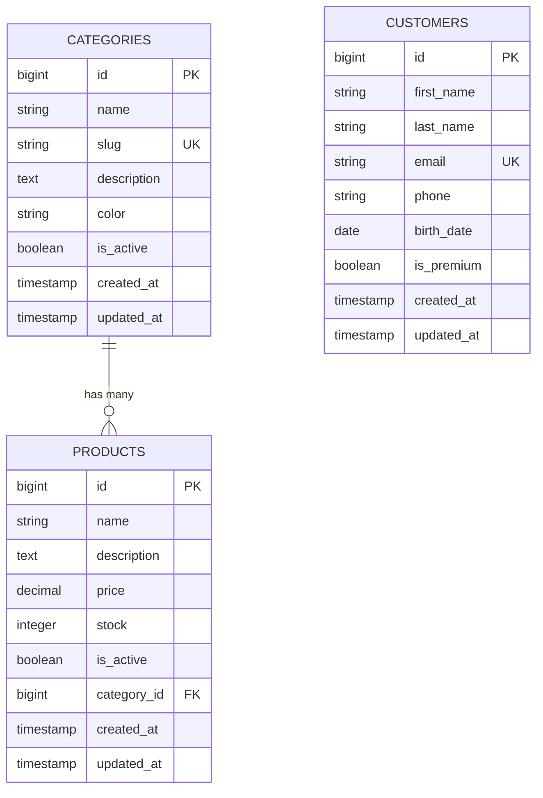
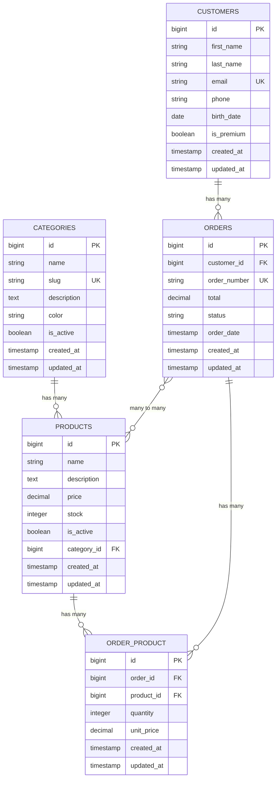
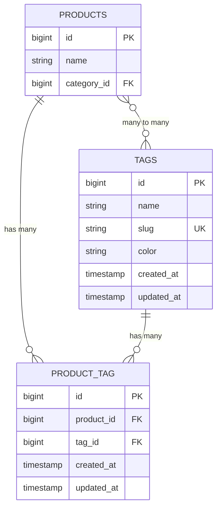

# Laravel: Relaciones entre Modelos, Seeders y Factory - Tutorial

## Información del Tutorial

**Duración:** 2.5 horas  
**Nivel:** Intermedio  
**Requisitos previos:** Conocimientos básicos de Laravel, migraciones y modelos  

## Objetivos de Aprendizaje

Al finalizar este tutorial, los estudiantes serán capaces de:
- Comprender y implementar diferentes tipos de relaciones entre modelos
- Crear y utilizar seeders para poblar la base de datos
- Trabajar con factories para generar datos de prueba
- Gestionar relaciones complejas entre tablas
- Aplicar buenas prácticas en el manejo de relaciones

---

## Contenido del Tutorial

### 1. Relaciones entre Modelos

Las relaciones son una de las características más poderosas de Eloquent. Vamos a implementar relaciones entre nuestras tablas.

#### Paso 1: Modificar la migración de productos para incluir category_id

```bash
# Crear migración para agregar foreign key
php artisan make:migration add_category_id_to_products_table
```

**Diagrama del modelo con primera relación:**



**Contenido de la migración:**

```php
<?php

use Illuminate\Database\Migrations\Migration;
use Illuminate\Database\Schema\Blueprint;
use Illuminate\Support\Facades\Schema;

return new class extends Migration
{
    public function up(): void
    {
        Schema::table('products', function (Blueprint $table) {
            $table->foreignId('category_id')->constrained()->onDelete('cascade');
        });
    }

    public function down(): void
    {
        Schema::table('products', function (Blueprint $table) {
            $table->dropForeign(['category_id']);
            $table->dropColumn('category_id');
        });
    }
};
```

#### Paso 2: Definir las relaciones en los modelos

**Modelo Category:**

```php
<?php

namespace App\Models;

use Illuminate\Database\Eloquent\Factories\HasFactory;
use Illuminate\Database\Eloquent\Model;

class Category extends Model
{
    use HasFactory;

    protected $fillable = [
        'name',
        'slug',
        'description',
        'color',
        'is_active'
    ];

    protected $casts = [
        'is_active' => 'boolean',
    ];

    // Relación: Una categoría tiene muchos productos
    public function products()
    {
        return $this->hasMany(Product::class);
    }
}
```

**Modelo Product:**

```php
<?php

namespace App\Models;

use Illuminate\Database\Eloquent\Factories\HasFactory;
use Illuminate\Database\Eloquent\Model;

class Product extends Model
{
    use HasFactory;

    protected $fillable = [
        'name',
        'description',
        'price',
        'stock',
        'is_active',
        'category_id'
    ];

    protected $casts = [
        'price' => 'decimal:2',
        'is_active' => 'boolean',
    ];

    // Relación: Un producto pertenece a una categoría
    public function category()
    {
        return $this->belongsTo(Category::class);
    }
}
```

#### Paso 3: Crear tabla de pedidos para relación muchos a muchos

```bash
# Crear migración para orders
php artisan make:migration create_orders_table

# Crear migración para la tabla pivot
php artisan make:migration create_order_product_table
```

**Diagrama del modelo completo con relaciones muchos a muchos:**



**Migración de orders:**

```php
<?php

use Illuminate\Database\Migrations\Migration;
use Illuminate\Database\Schema\Blueprint;
use Illuminate\Support\Facades\Schema;

return new class extends Migration
{
    public function up(): void
    {
        Schema::create('orders', function (Blueprint $table) {
            $table->id();
            $table->foreignId('customer_id')->constrained()->onDelete('cascade');
            $table->string('order_number')->unique();
            $table->decimal('total', 10, 2);
            $table->enum('status', ['pending', 'processing', 'shipped', 'delivered', 'cancelled']);
            $table->timestamp('order_date');
            $table->timestamps();
        });
    }

    public function down(): void
    {
        Schema::dropIfExists('orders');
    }
};
```

**Migración de la tabla pivot order_product:**

```php
<?php

use Illuminate\Database\Migrations\Migration;
use Illuminate\Database\Schema\Blueprint;
use Illuminate\Support\Facades\Schema;

return new class extends Migration
{
    public function up(): void
    {
        Schema::create('order_product', function (Blueprint $table) {
            $table->id();
            $table->foreignId('order_id')->constrained()->onDelete('cascade');
            $table->foreignId('product_id')->constrained()->onDelete('cascade');
            $table->integer('quantity');
            $table->decimal('unit_price', 8, 2);
            $table->timestamps();
        });
    }

    public function down(): void
    {
        Schema::dropIfExists('order_product');
    }
};
```

### 2. Seeders y Factory

Los **seeders** nos permiten poblar la base de datos con datos de prueba de forma automatizada.

#### Crear seeders:

```bash
# Crear seeders
php artisan make:seeder CategorySeeder
php artisan make:seeder ProductSeeder
php artisan make:seeder CustomerSeeder
```

**CategorySeeder:**

```php
<?php

namespace Database\Seeders;

use App\Models\Category;
use Illuminate\Database\Seeder;

class CategorySeeder extends Seeder
{
    public function run(): void
    {
        $categories = [
            [
                'name' => 'Electrónicos',
                'slug' => 'electronicos',
                'description' => 'Productos electrónicos y tecnología',
                'color' => '#007bff',
                'is_active' => true
            ],
            [
                'name' => 'Ropa y Accesorios',
                'slug' => 'ropa-accesorios',
                'description' => 'Vestimenta y accesorios de moda',
                'color' => '#28a745',
                'is_active' => true
            ],
            [
                'name' => 'Hogar y Jardín',
                'slug' => 'hogar-jardin',
                'description' => 'Artículos para el hogar y jardinería',
                'color' => '#ffc107',
                'is_active' => true
            ],
            [
                'name' => 'Deportes',
                'slug' => 'deportes',
                'description' => 'Equipos y accesorios deportivos',
                'color' => '#dc3545',
                'is_active' => true
            ]
        ];

        foreach ($categories as $categoryData) {
            Category::create($categoryData);
        }
    }
}
```

**ProductSeeder:**

```php
<?php

namespace Database\Seeders;

use App\Models\Product;
use App\Models\Category;
use Illuminate\Database\Seeder;

class ProductSeeder extends Seeder
{
    public function run(): void
    {
        $electronics = Category::where('slug', 'electronicos')->first();
        $clothing = Category::where('slug', 'ropa-accesorios')->first();
        $home = Category::where('slug', 'hogar-jardin')->first();
        $sports = Category::where('slug', 'deportes')->first();

        $products = [
            // Electrónicos
            [
                'name' => 'iPhone 15 Pro',
                'description' => 'Smartphone Apple con pantalla de 6.1 pulgadas',
                'price' => 999.99,
                'stock' => 50,
                'is_active' => true,
                'category_id' => $electronics->id
            ],
            [
                'name' => 'Laptop HP Pavilion',
                'description' => 'Laptop con procesador Intel i7 y 16GB RAM',
                'price' => 799.99,
                'stock' => 25,
                'is_active' => true,
                'category_id' => $electronics->id
            ],
            
            // Ropa
            [
                'name' => 'Camiseta Básica',
                'description' => 'Camiseta de algodón 100% en varios colores',
                'price' => 19.99,
                'stock' => 100,
                'is_active' => true,
                'category_id' => $clothing->id
            ],
            [
                'name' => 'Jeans Clásicos',
                'description' => 'Pantalón jean de corte clásico',
                'price' => 49.99,
                'stock' => 75,
                'is_active' => true,
                'category_id' => $clothing->id
            ],
            
            // Hogar
            [
                'name' => 'Aspiradora Robot',
                'description' => 'Aspiradora automática con WiFi',
                'price' => 299.99,
                'stock' => 20,
                'is_active' => true,
                'category_id' => $home->id
            ],
            
            // Deportes
            [
                'name' => 'Balón de Fútbol',
                'description' => 'Balón oficial de fútbol profesional',
                'price' => 39.99,
                'stock' => 40,
                'is_active' => true,
                'category_id' => $sports->id
            ]
        ];

        foreach ($products as $productData) {
            Product::create($productData);
        }
    }
}
```

**Actualizar DatabaseSeeder:**

```php
<?php

namespace Database\Seeders;

use Illuminate\Database\Seeder;

class DatabaseSeeder extends Seeder
{
    public function run(): void
    {
        $this->call([
            CategorySeeder::class,
            ProductSeeder::class,
        ]);
    }
}
```

**Ejecutar los seeders:**

```bash
# Ejecutar migraciones y seeders
php artisan migrate --seed

# O solo los seeders
php artisan db:seed
```

### 3. Trabajando con Factory (Factories)

Los **Factory** nos permiten generar grandes cantidades de datos de prueba de forma automatizada usando Faker.

#### Crear factories:

```bash
# Crear factories
php artisan make:factory CategoryFactory
php artisan make:factory ProductFactory
php artisan make:factory CustomerFactory
```

**CategoryFactory:**

```php
<?php

namespace Database\Factories;

use Illuminate\Database\Eloquent\Factories\Factory;
use Illuminate\Support\Str;

class CategoryFactory extends Factory
{
    public function definition(): array
    {
        $name = $this->faker->words(2, true);
        
        return [
            'name' => ucwords($name),
            'slug' => Str::slug($name),
            'description' => $this->faker->sentence(10),
            'color' => $this->faker->hexColor(),
            'is_active' => $this->faker->boolean(90), // 90% probabilidad de estar activo
        ];
    }

    // Estado para categorías inactivas
    public function inactive(): Factory
    {
        return $this->state(function (array $attributes) {
            return [
                'is_active' => false,
            ];
        });
    }

    // Estado para categorías específicas
    public function electronics(): Factory
    {
        return $this->state(function (array $attributes) {
            return [
                'name' => 'Electrónicos',
                'slug' => 'electronicos',
                'description' => 'Productos electrónicos y tecnología',
                'color' => '#007bff',
            ];
        });
    }
}
```

**ProductFactory:**

```php
<?php

namespace Database\Factories;

use App\Models\Category;
use Illuminate\Database\Eloquent\Factories\Factory;

class ProductFactory extends Factory
{
    public function definition(): array
    {
        return [
            'name' => $this->faker->words(3, true),
            'description' => $this->faker->paragraph(3),
            'price' => $this->faker->randomFloat(2, 10, 1000),
            'stock' => $this->faker->numberBetween(0, 100),
            'is_active' => $this->faker->boolean(85),
            'category_id' => Category::factory(), // Crea una categoría automáticamente
        ];
    }

    // Estado para productos caros
    public function expensive(): Factory
    {
        return $this->state(function (array $attributes) {
            return [
                'price' => $this->faker->randomFloat(2, 500, 2000),
            ];
        });
    }

    // Estado para productos sin stock
    public function outOfStock(): Factory
    {
        return $this->state(function (array $attributes) {
            return [
                'stock' => 0,
            ];
        });
    }

    // Estado para productos de una categoría específica
    public function forCategory(Category $category): Factory
    {
        return $this->state(function (array $attributes) use ($category) {
            return [
                'category_id' => $category->id,
            ];
        });
    }
}
```

**CustomerFactory:**

```php
<?php

namespace Database\Factories;

use Illuminate\Database\Eloquent\Factories\Factory;

class CustomerFactory extends Factory
{
    public function definition(): array
    {
        return [
            'first_name' => $this->faker->firstName(),
            'last_name' => $this->faker->lastName(),
            'email' => $this->faker->unique()->safeEmail(),
            'phone' => $this->faker->phoneNumber(),
            'birth_date' => $this->faker->date('Y-m-d', '-18 years'),
            'is_premium' => $this->faker->boolean(20), // 20% probabilidad de ser premium
        ];
    }

    // Estado para clientes premium
    public function premium(): Factory
    {
        return $this->state(function (array $attributes) {
            return [
                'is_premium' => true,
            ];
        });
    }

    // Estado para clientes jóvenes
    public function young(): Factory
    {
        return $this->state(function (array $attributes) {
            return [
                'birth_date' => $this->faker->date('Y-m-d', '-25 years'),
            ];
        });
    }
}
```

#### Usando las factories:

**Crear archivo de práctica con factories:**

```php
<?php

require_once 'vendor/autoload.php';
$app = require_once 'bootstrap/app.php';
$app->make(Illuminate\Contracts\Console\Kernel::class)->bootstrap();

use App\Models\Category;
use App\Models\Product;
use App\Models\Customer;

echo "=== PRÁCTICA CON FACTORIES ===\n\n";

// 1. Crear categorías usando factory
echo "1. CREANDO CATEGORÍAS CON FACTORY:\n";

// Crear 5 categorías aleatorias
$categories = Category::factory()->count(5)->create();
echo "✓ Creadas {$categories->count()} categorías aleatorias\n";

// Crear una categoría específica
$electronicsCategory = Category::factory()->electronics()->create();
echo "✓ Creada categoría específica: {$electronicsCategory->name}\n";

// Crear categorías inactivas
$inactiveCategories = Category::factory()->inactive()->count(2)->create();
echo "✓ Creadas {$inactiveCategories->count()} categorías inactivas\n\n";

// 2. Crear productos usando factory
echo "2. CREANDO PRODUCTOS CON FACTORY:\n";

// Crear 10 productos aleatorios
$products = Product::factory()->count(10)->create();
echo "✓ Creados {$products->count()} productos aleatorios\n";

// Crear productos caros
$expensiveProducts = Product::factory()->expensive()->count(3)->create();
echo "✓ Creados {$expensiveProducts->count()} productos caros\n";

// Crear productos sin stock
$outOfStockProducts = Product::factory()->outOfStock()->count(2)->create();
echo "✓ Creados {$outOfStockProducts->count()} productos sin stock\n";

// Crear productos para una categoría específica
$categoryProducts = Product::factory()->forCategory($electronicsCategory)->count(5)->create();
echo "✓ Creados {$categoryProducts->count()} productos para {$electronicsCategory->name}\n\n";

// 3. Crear clientes usando factory
echo "3. CREANDO CLIENTES CON FACTORY:\n";

// Crear 15 clientes aleatorios
$customers = Customer::factory()->count(15)->create();
echo "✓ Creados {$customers->count()} clientes aleatorios\n";

// Crear clientes premium
$premiumCustomers = Customer::factory()->premium()->count(3)->create();
echo "✓ Creados {$premiumCustomers->count()} clientes premium\n";

// Crear clientes jóvenes
$youngCustomers = Customer::factory()->young()->count(5)->create();
echo "✓ Creados {$youngCustomers->count()} clientes jóvenes\n\n";

// 4. Crear datos relacionados
echo "4. CREANDO DATOS RELACIONADOS:\n";

// Crear una categoría con productos
$categoryWithProducts = Category::factory()
    ->has(Product::factory()->count(8), 'products')
    ->create();

echo "✓ Creada categoría '{$categoryWithProducts->name}' con {$categoryWithProducts->products->count()} productos\n";

// Crear productos premium con factory
$premiumProducts = Product::factory()
    ->expensive()
    ->forCategory($categoryWithProducts)
    ->count(3)
    ->create();

echo "✓ Creados {$premiumProducts->count()} productos premium para la categoría\n\n";

// 5. Estadísticas finales
echo "5. ESTADÍSTICAS FINALES:\n";

$totalCategories = Category::count();
$totalProducts = Product::count();
$totalCustomers = Customer::count();

echo "📊 Total de registros creados:\n";
echo "   - Categorías: {$totalCategories}\n";
echo "   - Productos: {$totalProducts}\n";
echo "   - Clientes: {$totalCustomers}\n\n";

// Estadísticas adicionales
$activeProducts = Product::where('is_active', true)->count();
$premiumCustomersCount = Customer::where('is_premium', true)->count();
$averagePrice = Product::avg('price');

echo "📈 Estadísticas adicionales:\n";
echo "   - Productos activos: {$activeProducts}\n";
echo "   - Clientes premium: {$premiumCustomersCount}\n";
echo "   - Precio promedio: $" . number_format($averagePrice, 2) . "\n";

echo "\n=== FIN DE LA PRÁCTICA CON FACTORIES ===\n";
```

#### Comandos útiles para factories:

```bash
# Crear 50 productos usando factory
php artisan tinker
Product::factory()->count(50)->create();

# Crear productos con relaciones
Category::factory()->has(Product::factory()->count(10))->create();

# Usar estados específicos
Product::factory()->expensive()->outOfStock()->create();
```

### 4. Avanzado: Relaciones Polimórficas

Las relaciones polimórficas permiten que un modelo pertenezca a más de un tipo de modelo en una sola asociación.

#### Ejemplo: Sistema de comentarios para productos y categorías

```bash
# Crear migración para comentarios polimórficos
php artisan make:migration create_comments_table
```

**Migración de comentarios polimórficos:**

```php
<?php

use Illuminate\Database\Migrations\Migration;
use Illuminate\Database\Schema\Blueprint;
use Illuminate\Support\Facades\Schema;

return new class extends Migration
{
    public function up(): void
    {
        Schema::create('comments', function (Blueprint $table) {
            $table->id();
            $table->text('content');
            $table->string('author_name');
            $table->string('author_email');
            $table->morphs('commentable'); // Crea commentable_id y commentable_type
            $table->timestamps();
        });
    }

    public function down(): void
    {
        Schema::dropIfExists('comments');
    }
};
```

**Modelo Comment:**

```php
<?php

namespace App\Models;

use Illuminate\Database\Eloquent\Factories\HasFactory;
use Illuminate\Database\Eloquent\Model;

class Comment extends Model
{
    use HasFactory;

    protected $fillable = [
        'content',
        'author_name',
        'author_email',
        'commentable_id',
        'commentable_type'
    ];

    // Relación polimórfica
    public function commentable()
    {
        return $this->morphTo();
    }
}
```

**Actualizar modelos Product y Category:**

```php
// Agregar a Product y Category
public function comments()
{
    return $this->morphMany(Comment::class, 'commentable');
}
```

### 5. Ejercicios Prácticos

#### Ejercicio 1: Sistema de Tags (Many to Many)

Crear un sistema de etiquetas para productos:

```bash
# Crear migración para tags
php artisan make:migration create_tags_table

# Crear tabla pivot
php artisan make:migration create_product_tag_table
```

**Diagrama del ejercicio:**



#### Ejercicio 2: Sistema de Reviews

Implementar reseñas de productos:

```bash
# Crear modelo y migración
php artisan make:model Review -m
```

**Campos de la tabla reviews:**
- product_id (foreign key)
- customer_id (foreign key)
- rating (1-5)
- comment (text)
- is_verified_purchase (boolean)
- reviewed_at (timestamp)

---

## Buenas Prácticas

### 1. Nombramiento de Relaciones
- Usar nombres descriptivos: `products()`, `category()`, `reviews()`
- Singular para belongsTo: `category()`
- Plural para hasMany: `products()`

### 2. Eager Loading
```php
// ❌ Malo: N+1 queries
$products = Product::all();
foreach ($products as $product) {
    echo $product->category->name;
}

// ✅ Bueno: Una sola query adicional
$products = Product::with('category')->get();
foreach ($products as $product) {
    echo $product->category->name;
}
```

### 3. Factory States
- Crear estados específicos para diferentes escenarios
- Usar nombres descriptivos: `premium()`, `inactive()`, `expensive()`

### 4. Seeders Organizados
- Un seeder por modelo principal
- Usar el DatabaseSeeder para orquestar
- Considerar el orden de ejecución

---

## Comandos Útiles

```bash
# Relaciones
php artisan make:migration add_foreign_key_to_table
php artisan make:migration create_pivot_table

# Seeders
php artisan make:seeder ModelSeeder
php artisan db:seed
php artisan db:seed --class=SpecificSeeder

# Factories
php artisan make:factory ModelFactory
php artisan tinker
Model::factory()->count(10)->create();

# Limpiar y rehacer
php artisan migrate:fresh --seed
```

---

## Recursos Adicionales

### Documentación Oficial
- [Eloquent Relationships](https://laravel.com/docs/eloquent-relationships)
- [Database Seeding](https://laravel.com/docs/seeding)
- [Model Factories](https://laravel.com/docs/database-testing#model-factories)

### Próximos Pasos
1. Aprender sobre relaciones polimórficas avanzadas
2. Implementar soft deletes en relaciones
3. Explorar query scopes para relaciones
4. Practicar con observers para eventos de relaciones
5. Optimizar consultas con índices compuestos

---

## Conclusión

Las relaciones entre modelos, seeders y factories son herramientas fundamentales para construir aplicaciones Laravel robustas y escalables. Dominar estos conceptos te permitirá:

- Modelar datos complejos de forma eficiente
- Generar datos de prueba de calidad
- Mantener la integridad referencial
- Optimizar el rendimiento de las consultas

**Recuerda**: La práctica constante es clave para dominar estos conceptos. Experimenta con diferentes tipos de relaciones y escenarios para fortalecer tu comprensión.

¡Felicitaciones por completar este tutorial especializado!
